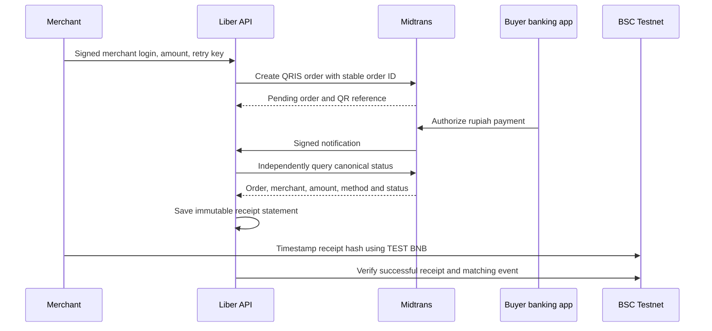

# Liber merchant QRIS pilot

One merchant issues a rupiah invoice through Midtrans. The buyer scans its QRIS using a banking or e-wallet app. Liber checks the provider directly and produces a receipt statement; anyone may timestamp its hash on BSC Testnet.

**Current status (1 October 2026):** sandbox Server Key and merchant configuration are stored on the backend, the sandbox webhook is configured, and the API deployment is live. Only the configured merchant wallet may issue invoices; the browser's different device wallet was correctly rejected. The first provider account E2E test still awaits merchant wallet sign-in. Real QRIS payments are not active, and fixture-based CI tests do not establish production payment capability.

## Payment and evidence

Midtrans remains the source of payment status and handles merchant bank disbursement. The registry records a hash and its timestamp; it does not independently verify fiat payment, guarantee delivery or identify the recorder as the merchant. Payment confirmation is distinct from disbursement to the merchant's bank.

The public statement contains a random invoice reference, a random receipt reference, original invoice amount, IDR currency, environment, provider status and time observed. Refund statements describe the **original invoice amount**, not a refunded amount. A refund or partial refund creates a new statement; older recordings remain historical evidence.

Customer identity, raw provider transaction IDs, merchant provider IDs, credentials and raw QR payloads are excluded from public statements and chain data. Public checkout/receipt links intentionally reveal the merchant display name, invoice amount and status to anyone holding the unguessable link. Share them with that visibility in mind.

## Connect the sandbox first

1. The merchant creates their own [Midtrans account](https://dashboard.midtrans.com). Complete account agreements and any verification personally.
2. Select **Sandbox** and obtain its Server Key and merchant ID. Enter the key directly into the backend Vercel project's environment settings; never put it in chat, source control or a frontend variable.
3. Configure these backend variables and redeploy the API:

| Variable | Sandbox value |
|---|---|
| `PILOT_ENABLED` | `true` |
| `MIDTRANS_MODE` | `sandbox` |
| `MIDTRANS_SERVER_KEY` | Sandbox Server Key, entered privately |
| `MIDTRANS_MERCHANT_ID` | Merchant ID from the same account |
| `PILOT_MERCHANT_WALLET` | Wallet address authorized to issue invoices |
| `PILOT_MERCHANT_NAME` | Merchant display name |
| `PILOT_MAX_AMOUNT_IDR` | `100000` initially |
| `MIDTRANS_LIVE_CONFIRMED` | `false` |
| `RECEIPT_REGISTRY_ADDRESS` | Deployed chain-97 address from `contracts/deployments/liber-receipt-registry.bsc-testnet.json` |

4. Set the Midtrans payment notification URL to `https://liber-bnb-api.vercel.app/pilot/midtrans/notification`.
5. Open [the pilot](https://liber-bnb-web.vercel.app/pilot), sign in with the configured merchant wallet, and create a Rp10,000 sandbox invoice. Use the provider's sandbox tools to simulate payment; **do not send real money**.
6. Check that settlement appears only after the canonical provider query. Exercise duplicate notifications, expired invoices and refund updates. Record the settlement hash using TEST BNB, then verify its event through the public receipt. Save the provider test evidence separately.

For the first connected-account test, use a browser with the configured wallet extension, sign in on `/pilot`, and create a Rp10,000 sandbox invoice. The Codex in-app browser has no injected wallet extension; its device wallet may be a different address. Do not change the merchant address merely to bypass this check. Use the official [QRIS simulator](https://simulator.sandbox.midtrans.com/v2/qris/index), not a real banking app.

No Client Key is required: this integration uses server-side Core API and a proxied provider QR image. Buyer checkout does not require a crypto wallet. The merchant wallet identifies who can issue an invoice; its sign-in signature never authorizes a rupiah payment.

## Activate one real merchant

Complete Midtrans production onboarding and enable QRIS for the merchant account. After sandbox checks pass, enter the **production** Server Key and matching merchant ID privately, set `MIDTRANS_MODE=production`, and set `MIDTRANS_LIVE_CONFIRMED=true` only after provider approval. Keep the initial invoice cap at Rp100,000. Redeploy the API and verify that the pilot explicitly shows production.

The merchant and an authorized buyer perform one small, agreed real transaction, verify it in the provider dashboard, and check merchant bank disbursement separately. We have not performed this step. Sandbox orders remain sandbox and cannot be confirmed using production credentials.

Before expanding the pilot, establish merchant support, reconciliation, refunds, record retention and incident handling, and review operational and regulatory requirements with the provider. This release has no automatic refunds, crypto conversion, QRIS interoperability service or mainnet receipt contract.

## Failure behavior

- Missing credentials or approval: invoice creation stays disabled; no substitute QR is generated.
- Slow or unknown charge outcome: retain the invoice's retry key and provider order ID, query status before retrying the charge, and show `creating` rather than a payment claim.
- Duplicate settlement: one receipt per invoice/status. Unique keys and database locks protect concurrent retries.
- Forged or altered notification: validate SHA-512 signature, then fetch status from the official provider. Notification status itself is not signed by Midtrans and is not trusted.
- Mismatched merchant, order, amount, currency, method or transaction: no paid receipt.
- Delayed notification after refund: never restore a paid status from an older pending/settlement result.
- Failed receipt recording: preserve the submitted transaction hash; confirmation retries do not send another transaction. Fiat payment status is unaffected.

Provider references: [QRIS Core API](https://docs.midtrans.com/reference/qris), [transaction status](https://docs.midtrans.com/reference/get-transaction-status), [notifications](https://docs.midtrans.com/docs/https-notification-webhooks), [production migration](https://docs.midtrans.com/docs/how-do-i-migrate-my-account-from-sandbox-to-production).
