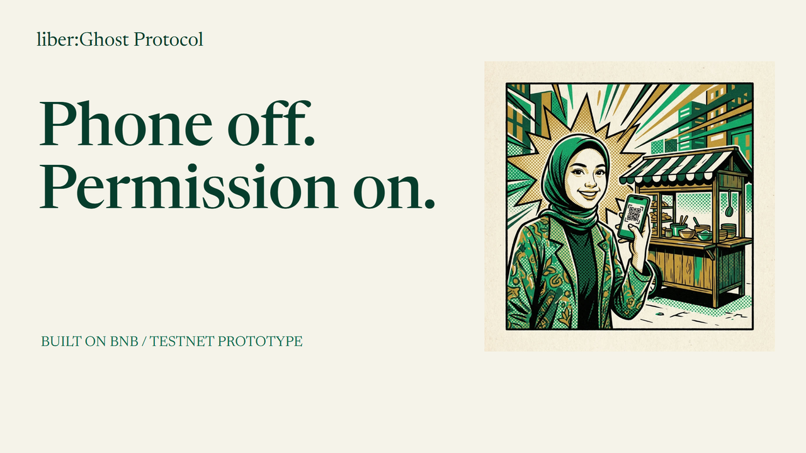
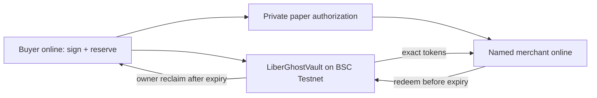

# liber:Ghost Protocol

**A prefunded payment permission that can leave your phone.**

The sandwich is ready. Your battery is not. Prepare a limited authorization online, reserve tokens, and carry the permission on paper. The named merchant claims once with their wallet. The merchant remains online.

**BNB Smart Chain Testnet · chain 97 · MockUSDC has no cash value.**

[Open Ghost](https://liber-bnb-web.vercel.app/ghost) · [Judge guide](docs/GHOST-JUDGE-GUIDE.md) · [Submission](SUBMISSION.md) · [Pitch deck](submission/Liber-Ghost-Protocol-Pitch.pdf)

[Download the latest video, editable deck and complete submission package](https://github.com/agadape/Liber_BnB_hackathon_2026/releases/tag/ghost-submission-2026-10-05).

## How it works

1. **Prepare online.** Choose one merchant, the exact amount and an expiry. Sign an EIP-712 authorization and reserve tokens in the vault.
2. **Hand over privately.** Paper/QR carries the constrained signature, never the wallet key. Reserve calldata excludes the signature.
3. **Claim once.** Only the named merchant can redeem before expiry. Replay fails. Redemption reveals the authorization in public calldata.
4. **Recover unused funds.** At or after expiry, the owner sends a reclaim transaction. Recovery is not automatic; early cancellation is unavailable.

## Public evidence

| Evidence | Inspect |
|---|---|
| 5 MockUSDC to the named merchant | [Public receipt](https://liber-bnb-web.vercel.app/ghost/receipt?id=0xdfad2e816fba512fdda912ced241d9464c3f1358c16427fcfd7ac3fac2067924) · [Redemption](https://testnet.bscscan.com/tx/0xea11ffb59b93e621f6f08ef221f91303e3c74c4392967e655bd2e6b7ec414b00) |
| 2 MockUSDC reclaimed after expiry | [Public receipt](https://liber-bnb-web.vercel.app/ghost/receipt?id=0x5f04a6af2b67a0519ed123946b3b5834d5648974ea23edfd8c70fbf2c0a567fb) · [Reclaim](https://testnet.bscscan.com/tx/0x0f8b2ecf962ffc1ba6e14aa3a27b407d3fcb4871f39a01c4f7227780f44eceb2) |
| Exact contract source match | [Sourcify](https://repo.sourcify.dev/97/0x0837ac35ec54F678ba08912dcfd6166a299FCA31) |
| On-chain enforcement exercise | [Report](contracts/deployments/ghost-demo-e2e.json) |
| Hosted browser redemption / replay | [Report](contracts/deployments/ghost-ui-e2e.json) |
| Hosted API checks | [Report](contracts/deployments/ghost-production-check.json) |

Vault: [`0x0837ac35ec54F678ba08912dcfd6166a299FCA31`](https://testnet.bscscan.com/address/0x0837ac35ec54F678ba08912dcfd6166a299FCA31)

MockUSDC: [`0x2116D4a3f11Aa7059Ad0911ad5C89897CC0BcC97`](https://testnet.bscscan.com/address/0x2116D4a3f11Aa7059Ad0911ad5C89897CC0BcC97), 18 decimals.

Recorded main build: 171 tests (frontend 61, backend 84, contracts 26), plus 12 hosted API checks. These are engineering evidence, not an independent security audit.

## Boundaries

Preparation needs a connected buyer wallet. Redemption needs a connected merchant wallet and TEST BNB gas. EOA wallets only; smart/delegated wallets are unsupported. Proofs check canonical events and exact ERC-20 transfers with a 12-confirmation threshold, not an absolute finality guarantee.

Physical buyer-phone-off and printed-paper tests remain pending. The recorded browser exercise closed a voucher tab, not the whole device. Ghost does not settle rupiah, pay arbitrary QRIS codes, verify delivery, or claim regulatory approval. Test tokens have no cash value.

## Code and materials

- `frontend/`: Next.js wallet workspace, handover, redemption and public receipts.
- `backend/`: SIWE sessions, unsigned metadata and verified public proof records.
- `contracts/`: immutable Ghost vault, tests and execution/verification records.
- [Implementation ledger](docs/GHOST-IMPLEMENTATION.md)
- [Project detail](submission/project-detail.md)
- [Pitch and Q&A](docs/GHOST-PITCH-QA.md)
- [Remotion source and build instructions](media/ghost-video/README.md)
- [YouTube upload copy](submission/YOUTUBE.md)

Use each application's documented setup. Do not point integration tests at shared production databases. Earlier QRIS sandbox and BNB invoice paths remain separate Liber experiments; their [previous documentation](docs/GHOST-LEGACY-SCOPE.md) and [old video](https://youtu.be/WyFs-pF5AYM) describe the earlier product, not Ghost.
