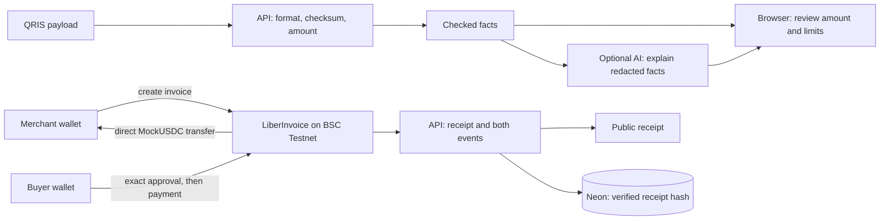

# liber:Ghost Protocol

**Your phone can die. Your permission doesn't have to.**

Ghost adds a prefunded, merchant-bound paper payment authorization to Liber. A buyer prepares online, signs an EIP-712 voucher and reserves MockUSDC. The online merchant scans the paper and redeems once using their own wallet. Unused funds can be reclaimed by the owner after expiry. Reserved tokens are held in the vault until redemption or reclaim.

**BSC Testnet only. MockUSDC has no monetary value.** Buyer offline does not mean merchant offline. Handing over the QR lets its named merchant claim immediately; Ghost does not guarantee delivery, pay QRIS, convert crypto to rupiah or establish production regulatory compliance.

- [Ghost vault on BscScan](https://testnet.bscscan.com/address/0x0837ac35ec54F678ba08912dcfd6166a299FCA31)
- [Deployment identity](contracts/deployments/liber-ghost-vault.bsc-testnet.json) · [technical runbook](docs/GHOST-RUNBOOK.md)
- Routes: `/ghost`, `/ghost/create`, `/ghost/merchant`, `/ghost/vouchers`, `/ghost/receipt?id=…`.
- Feature flags default **off** until release verification passes. The old public video below documents the previous QRIS/invoice scope.

## Ghost: the core idea

A person can prepare a small, fixed permission for a known merchant, then carry it on paper without carrying a live wallet. The merchant receives no private key and cannot redirect the funds, increase the amount or claim twice. Both wallets agree on the recipient before preparation. The buyer still needs a connection to prepare; the merchant needs a connection to redeem.

BNB holds the reservation and enforces who may claim, how much, once, and before which expiry. A paper copy is a constrained authorization. Database records and QR readability never substitute for a canonical transfer receipt. This V1 deliberately uses only valueless MockUSDC on BSC Testnet.

```mermaid
sequenceDiagram
  participant B as Buyer online
  participant V as Ghost vault on BSC Testnet
  participant P as Paper authorization
  participant M as Merchant online
  B->>B: Review merchant, amount, expiry; sign EIP-712
  B->>V: Approve exact amount, reserve without signature
  V-->>B: Funded reservation, 12 confirmations checked
  B->>P: Export verified QR locally
  Note over B,P: Buyer can leave the device behind
  P->>M: Hand over fixed merchant authorization
  M->>V: Check live state; redeem with merchant wallet
  V-->>M: Exact MockUSDC transfer, one claim only
  Note over B,V: If unused: owner requests reclaim at/after expiry
```

### Evidence and release state

- [Actual Ghost testnet report](contracts/deployments/ghost-demo-e2e.json): separate buyer/merchant processes; 5 MockUSDC transferred, wrong merchant and replay rejected; 2 MockUSDC reclaimed after expiry, early reclaim rejected.
- [Redemption transaction](https://testnet.bscscan.com/tx/0xea11ffb59b93e621f6f08ef221f91303e3c74c4392967e655bd2e6b7ec414b00) · [reclaim transaction](https://testnet.bscscan.com/tx/0x0f8b2ecf962ffc1ba6e14aa3a27b407d3fcb4871f39a01c4f7227780f44eceb2).
- [Exact Sourcify source match](https://repo.sourcify.dev/97/0x0837ac35ec54F678ba08912dcfd6166a299FCA31), Solidity 0.8.24, optimizer 200, Paris. No upgrade/admin withdrawal or fee.
- [Ghost branch preview](https://liber-bnb-web-git-codex-ghost-protocol-daves-projects-3628ad99.vercel.app/ghost) is enabled for testnet review. Vercel team login may be required for the frontend. Production `main` remains the previous app until release gates pass.
- CI run [36981441878](https://github.com/agadape/Liber_BnB_hackathon_2026/actions/runs/36981441878): frontend 61/61, API 84/84 on disposable PostgreSQL, contracts 26/26 including fuzz/invariants; types, lint and production build passed.
- [Hosted browser test](contracts/deployments/ghost-ui-e2e.json): reserve and QR preparation through UI, merchant redeemed after the buyer voucher tab closed, exact 5 MockUSDC received, same QR rejected on rescan. A separate buyer funds tab remained open; device-offline behavior is not claimed. [Inspect UI redemption](https://testnet.bscscan.com/tx/0xc6671085ab00f55cc9a4cdf231060343a785ae917c82302c444b6cdfc3abb91b).
- [Hosted API checks](contracts/deployments/ghost-hosted-check.json): SIWE, wallet isolation, concurrent idempotent metadata, public transfer proofs, bounded owner recovery and owner-bound recovery cursors passed. The API preview has one public-domain exception; owner/merchant endpoints still require wallet authentication.
- **Physical paper readability, buyer phone-off footage and injected-wallet device checks are pending.** The previous video is not evidence of these Ghost steps. This MVP has no independent security audit.
- Full execution ledger: [implementation blueprint](docs/GHOST-IMPLEMENTATION.md). Operational and rollback rules: [runbook](docs/GHOST-RUNBOOK.md). Disabling issuance preserves expired-owner recovery; it cannot revoke already signed on-chain permissions.

## Existing Liber flows

**A clear payment. A visible receipt.**

Liber combines a merchant QRIS pilot for rupiah payments through Midtrans with receipt hashes on BNB, and a separate self-custodial test-token invoice demo. The hosted on-chain flows use **BSC Testnet (97)** and **MockUSDC with no monetary value**. A connected Midtrans account has completed a Rp10,000 sandbox payment and a verified BNB receipt recording. Real payments are not active.

**Indonesia Web3 Hackathon 2026 · Finance & Commerce / Consumer Apps**

- [90-second BNB video](https://youtu.be/WyFs-pF5AYM) — English narration and subtitles; QR checks, sandbox checkout and public testnet receipts.
- [Two-minute demo](https://liber-bnb-web.vercel.app/demo) — QRIS sandbox, BNB invoices and QR checks in one compact walkthrough; completed proofs need no wallet.
- [Merchant QRIS pilot](https://liber-bnb-web.vercel.app/pilot) — connection status, rupiah checkout and provider-backed receipts; [setup and limits](PILOT.md).
- [Confirmed QRIS sandbox receipt](https://liber-bnb-web.vercel.app/pilot/receipt?id=5e28547c-4936-4fdf-970b-198fc623fcf4) — Rp10,000 simulated through the official Midtrans simulator, with a verified receipt hash on BSC Testnet; [test evidence](contracts/deployments/pilot-sandbox-e2e.json).
- [Merchant Mode](https://liber-bnb-web.vercel.app/merchant) — create, share and cancel on-chain invoices.
- [Demo funds](https://liber-bnb-web.vercel.app/demo/funds) — read actual TEST BNB and MockUSDC balances, find a gas faucet, and claim 1,000 demo tokens with a wallet-signed transaction. Use different merchant and buyer wallets.
- [Confirmed payment proof](https://liber-bnb-web.vercel.app/receipt?id=0x9472aacf99e2369eaf65a51d2e7b0f515c6433ac32d0450da1b18e9465ded034) — a real transfer of 5 test tokens between two test wallets.
- [API health](https://liber-bnb-api.vercel.app/health) · [CI](https://github.com/agadape/Liber_BnB_hackathon_2026/actions).

## Problem and solution

### Hackathon scope: sandbox throughout

The hosted demo deliberately stays on **Midtrans Sandbox + BSC Testnet**. Production onboarding is deferred. The landing page opens for everyone, including returning wallet users, and links directly to completed evidence. The QRIS workspace identifies the payment environment before invoice creation and checkout; provider confirmation is kept distinct from the BNB hash recording.

A familiar merchant QR does not tell a crypto user which on-chain payment they can safely authorize. Reading an amount, confirming the recipient, and distinguishing an estimate from actual settlement are separate steps.

Liber makes those steps visible. Deterministic checks inspect the QR format and checksum. An optional AI explanation summarizes only those checked facts. A native Liber invoice specifies a receiving wallet, exact token amount and expiry; the buyer reviews and signs in their own wallet. Public proof is checked against BSC receipts.

**QR inspection is reference only.** A valid checksum does not prove merchant identity. Native Liber invoices are a separate token payment flow. The QRIS pilot issues new provider-backed invoices after a merchant account is connected; it does not pay arbitrary scanned merchant QRs, convert crypto, credit a Kolo card or prove goods delivery.

## What works

| Feature | Evidence / limits |
|---|---|
| QR inspection | Strict TLV parsing, CRC16, IDR/Indonesia checks and positive amounts. Corrupted samples are rejected. |
| Payment Copilot | Checked facts first; optional Indonesian AI explanation through Vercel AI Gateway. Clear checks-only fallback when AI is unavailable. |
| Merchant invoices | BSC contract records recipient, amount, expiry, payer and paid/cancelled state. Wallet signs creation and cancellation. |
| Buyer checkout | Exact token approval, followed by a separate payment signature; no server transaction signer. |
| Public receipt | Successful transaction receipt, matching InvoicePaid event **and** exact MockUSDC Transfer event. Chain state is read again on refresh. |
| Wallet app | Local test wallet or injected EVM wallet, signed authentication, balances, scanning and verified transfer history. |
| QRIS pilot integration | Merchant-only creation, stable retry keys, canonical Midtrans status verification, duplicate and refund handling. Connected-account sandbox E2E passed for Rp10,000; production activation remains pending. |
| Receipt hash registry | Permissionless, immutable hash timestamps on BSC Testnet. Environment/status are bound inside the statement hash; BNB does not independently confirm fiat payment. |

## Native BNB contract

| Contract | BSC Testnet address |
|---|---|
| **LiberGhostVault** — Ghost project contract | [0x0837ac35ec54F678ba08912dcfd6166a299FCA31](https://testnet.bscscan.com/address/0x0837ac35ec54F678ba08912dcfd6166a299FCA31) |
| **LiberInvoice** — existing invoice demo | [0x2ad1785460b3c60b0131b0649b37dacf3dc17b1c](https://testnet.bscscan.com/address/0x2ad1785460b3c60b0131b0649b37dacf3dc17b1c) |
| MockUSDC — open faucet, 18 decimals | [0x2116D4a3f11Aa7059Ad0911ad5C89897CC0BcC97](https://testnet.bscscan.com/address/0x2116D4a3f11Aa7059Ad0911ad5C89897CC0BcC97) |
| **LiberReceiptRegistry** — pilot receipt hash timestamps | [0xf1267a5ab17b61c5c110b95d4dbb6197ffbbb46d](https://testnet.bscscan.com/address/0xf1267a5ab17b61c5c110b95d4dbb6197ffbbb46d#code) |

LiberInvoice is testnet-only. It has no owner, upgrade, service fee or custody balance: transferFrom moves tokens directly from buyer to recipient, and the contract checks the recipient received the exact amount. Paid, cancelled, expired and unknown invoices reject payment. Merchants cannot pay their own invoice.

Source verification has an [exact creation/runtime match on Sourcify](https://repo.sourcify.dev/97/0x2Ad1785460b3C60b0131b0649B37dACF3DC17b1C). BscScan source publication is pending because its upstream service reported a daily submission limit. Deployment records and compiler input are in contracts/deployments/ and contracts/verification/.

LiberReceiptRegistry has an exact source match on [BscScan](https://testnet.bscscan.com/address/0xf1267a5ab17b61c5c110b95d4dbb6197ffbbb46d#code) and [Sourcify](https://repo.sourcify.dev/97/0xF1267a5AB17b61C5c110B95d4dbb6197ffBbB46D). It timestamps opaque receipt hashes without accepting funds. Its deployment does not establish production QRIS payment capability.

[Inspect the confirmed test payment on BscScan](https://testnet.bscscan.com/tx/0x572e268f3a2a835dacfdfcadd1874997720f3b905f35bed52cc3f1101e263241). Its invoice ID and creation, approval and payment hashes are recorded in [demo-invoice.json](contracts/deployments/demo-invoice.json).

## Architecture



Three independent directories: frontend/ (Next.js 16), backend/ (Hono + Postgres), contracts/ (Solidity 0.8.24 + Foundry). Web and API deploy separately on Vercel; Neon provides Postgres. No private key is sent to the API.

## AI boundaries and status

The model receives only nominal amount, QR method and validation flags. Raw QR, merchant text, wallet addresses, sessions and private keys are excluded. It cannot choose a recipient, change an amount, approve tokens or sign a transaction. All payment checks remain deterministic.

AI is gated by COPILOT_ENABLED and server-side Vercel OIDC authentication. Atomic database accounting caps model attempts at **100 per UTC day** across the deployment. The public demo accepts only built-in samples; real QR explanations require wallet authentication. The UI labels model output as AI only after a successful, validated model response.

**Live AI activation currently awaits user-completed card verification for Vercel's free credits.** Checks-only explanations work without it. No paid credits or auto top-up have been enabled.

## Security and verification

- EIP-4361 challenges expire in five minutes; nonce consumption is atomic.
- Bearer sessions expire in 30 minutes; only token hashes are stored. Wallet routes enforce ownership.
- Invoice receipt recording accepts chain evidence, not client success claims. Unique invoice/transaction constraints prevent duplicate records.
- Submitted transaction hashes survive page refresh in sessionStorage; confirmation retries do not resend payment.
- CI checks frontend tests/types/lint/build, backend tests/types/migrations and contract tests. LiberInvoice includes replay, expiry, cancellation, failed transfer rollback and exact-amount fuzz coverage (256 runs).

These checks are engineering evidence, not an independent security audit. Use test tokens only.

## Run locally

Each app runs independently:

```bash
cd backend
npm ci
cp .env.example .env
# Set DATABASE_URL; defaults target the deployed BSC testnet contracts.
npm run migrate
npm run dev
```

```bash
cd frontend
npm ci
cp .env.local.example .env.local
# Set NEXT_PUBLIC_BACKEND_URL to your API.
npm run dev
```

For an existing database, apply the additive migrations: backend/src/db/security-migration.sql, backend/src/db/product-migration.sql and backend/src/db/pilot-migration.sql. Set INVOICE_CONTRACT_ADDRESS on the backend. Enable COPILOT_ENABLED=true only after AI Gateway credits are ready; Vercel supplies its server OIDC token. See [PILOT.md](PILOT.md) for private backend credential setup and the sandbox-to-production gate.

Run npm test in each app, and forge test in contracts/. See [MIGRATION-BNB.md](MIGRATION-BNB.md) for the original Stellar-to-BNB migration and [SUBMISSION.md](SUBMISSION.md) for the judge walkthrough.

## Demo video

[Watch the current BNB demo on YouTube](https://youtu.be/WyFs-pF5AYM) — 90 seconds with English narration and subtitles. It demonstrates QR checks, the Midtrans QRIS sandbox checkout, public BNB receipt commitments and the completed 5 MockUSDC invoice. All demonstrated payment flows use sandbox/testnet funds.
