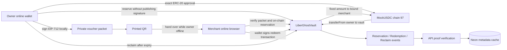
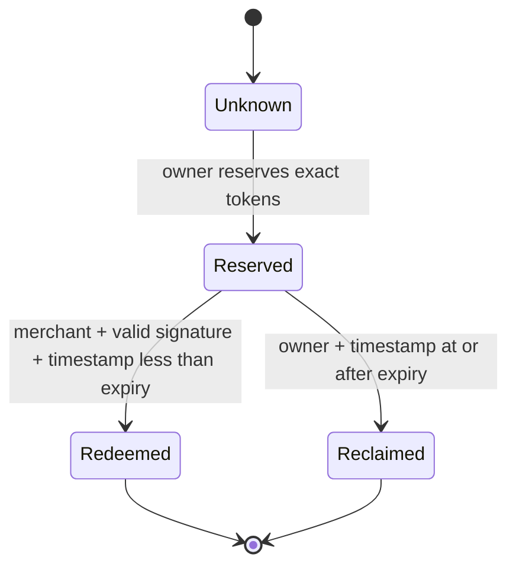

# liber:Ghost Protocol — Implementation Blueprint

> **Your wallet survives your phone.**
>
> Demo utama: pembeli menyiapkan voucher saat online, mencetaknya, mematikan ponsel, lalu merchant online menebus voucher untuk menerima MockUSDC di BSC Testnet. Pemindaian ulang ditolak. Voucher lain yang kedaluwarsa dapat dikembalikan ke pembeli.

**Tanggal:** 2 October 2026, Asia/Jakarta
**Versi dokumen:** 1.0 / protocol `ghost-v1`
**Status:** protokol, aplikasi, API dan preview testnet telah diimplementasikan. Transaksi redeem/reclaim serta alur UI reserve → QR → redeem → penolakan ulang telah dibuktikan. Pengujian fisik paper/phone-off dan perangkat wallet masih menjadi gate rilis production.
**Nama file:** `IMPLEMENTATHOIN.MD`, mengikuti nama yang diminta pengguna.
**Pemilik keputusan produk:** pemilik proyek Liber.
**Lingkungan MVP:** BSC Testnet, chain ID `97`, MockUSDC tanpa nilai uang.

---

## 0. Cara menggunakan dokumen ini

Dokumen ini adalah acuan implementasi berikutnya. Mulai dari bagian 1–6, kemudian kerjakan milestone secara berurutan di bagian 24. Jangan menafsirkan contoh API, SQL, atau Solidity di sini sebagai kode yang sudah tersedia.

Aturan pelaksanaan:

1. Pertahankan satu protokol dan satu perjalanan demo utama. Jangan menambahkan quest, cashback, marketplace, AI agent, atau konversi crypto sebagai bagian dari milestone Ghost.
2. Setiap perubahan aturan dana, penerima, signature, expiry, atau pemulihan harus memperbarui dokumen, fixture protokol, dan pengujian sebelum deploy.
3. Pisahkan status `planned`, `implemented`, `tested`, `deployed`, dan `proven`. Build berhasil bukan bukti pembayaran berhasil.
4. Gunakan bukti chain untuk status dana. Database dan browser adalah cache serta catatan pengalaman pengguna.
5. Saat melanjutkan setelah reset, baca bagian 25 dan isi ledger pekerjaan. Jangan memulai ulang bagian yang sudah memiliki bukti selesai.
6. Implementasi kode, migrasi database, dan deployment merupakan pekerjaan berikutnya. Pembuatan dokumen ini tidak mengaktifkan transaksi atau mengubah layanan live.

### 0.1 Lokasi dan sumber yang diperiksa

Workspace aktif saat dokumen dibuat:

```text
C:/Project_Dave/Liber_bnb
```

Checkout aktif berada di `C:/Project_Dave/Liber_bnb/app`, branch `codex/ghost-protocol`. Snapshot baseline yang sebelumnya diperiksa berada di:

```text
C:/Users/LENOVO/Documents/Codex/2026-09-29/lets-start-this-new-project-shall/outputs/stellar-apac
```

Snapshot lama berada di luar writable roots sesi ini. Gunakan untuk referensi baca. Sebelum implementasi, siapkan checkout yang dapat ditulis di workspace yang diizinkan, cek Git remote/HEAD/perubahan lokal, lalu bandingkan dengan snapshot. Jangan menganggap snapshot adalah HEAD remote terbaru.

Repository target: [agadape/Liber_BnB_hackathon_2026](https://github.com/agadape/Liber_BnB_hackathon_2026). Situs existing: [liber-bnb-web.vercel.app](https://liber-bnb-web.vercel.app/).

---

## 1. Keputusan produk yang sudah dikunci

### 1.1 Masalah dan pengguna pertama

Pengguna yang ingin menyediakan pembayaran kecil untuk merchant tertentu tanpa membawa perangkat atau memberikan akses wallet utamanya kepada orang yang membawakan voucher.

Kasus demo pertama adalah transaksi testnet antara satu pembeli dan satu merchant yang sudah mengetahui alamat masing-masing. Ini bukan layanan pembayaran rupiah yang telah diizinkan atau integrasi offline QRIS.

### 1.2 Janji MVP

Pengguna yang **sebelumnya online** dapat:

- memilih merchant wallet;
- menetapkan nominal tetap dan waktu kedaluwarsa;
- menandatangani otorisasi terbatas;
- mencadangkan token pada kontrak;
- mencetak QR yang berisi otorisasi tersebut;
- menyerahkan QR ketika perangkatnya offline atau mati.

Merchant yang **sedang online** dapat memverifikasi dan menebus voucher menggunakan wallet miliknya sendiri.

### 1.3 Batas kemampuan

| Pertanyaan | Jawaban MVP |
|---|---|
| Pembeli offline saat menyerahkan voucher? | Ya, setelah persiapan dan pencadangan dana saat online. |
| Merchant offline saat menerima final payment? | Tidak. Verifikasi dan penyelesaian membutuhkan RPC/koneksi. |
| Nominal bisa diubah di kasir? | Tidak. Voucher memiliki nominal tetap. |
| Voucher berlaku untuk merchant mana pun? | Tidak. Satu alamat penerima sudah terikat. |
| Merchant membayar gas? | Ya, dengan TEST BNB. |
| Pembeli perlu gas saat checkout? | Tidak; pembeli sudah membayar gas saat approval/reserve. |
| Pembeli bisa membatalkan voucher aktif? | Tidak. Dana hanya dapat diambil kembali setelah expiry. |
| Barang/jasa dijamin oleh kontrak? | Tidak. Kontrak mengatur token dan otorisasi, bukan penyerahan barang. |
| Dana tetap di EOA pembeli? | Tidak. Dana voucher dititipkan pada kontrak selama reservation. |
| Voucher membawa private key? | Tidak. Ia membawa signature untuk satu pesan dengan batas tetap. |
| QR boleh difoto? | Bisa disalin; salinan tidak boleh menghasilkan klaim kedua atau penerima baru. |
| Orang lain boleh membawa kertas? | Ya. Merchant tujuan dapat menebusnya setelah menerima signature. |
| Integrasi Midtrans digunakan untuk klaim Ghost? | Tidak. Midtrans sandbox tetap merupakan alur terpisah. |

### 1.4 Trade-off yang wajib terlihat

Merchant tujuan dapat menebus voucher segera setelah mendapat QR yang valid. Tidak ada bukti barang diterima dan tidak ada persetujuan tambahan dari pembeli ketika ponselnya mati.

Voucher yang hilang dapat digunakan orang lain untuk menyerahkan otorisasi ke merchant tujuan. Pembatasan penerima mengurangi kemungkinan pengalihan dana, tetapi tidak membuktikan siapa pembawanya atau melindungi dari kolusi merchant.

Tidak ada jalur cancel-before-expiry dalam V1. Menambahnya nanti akan mengubah asumsi penerimaan voucher dan harus diperlakukan sebagai versi protokol baru.

---

## 2. Apa yang dipakai ulang dan apa yang dibangun

### 2.1 Baseline yang diperiksa

| Komponen existing | Bukti snapshot | Keputusan Ghost |
|---|---|---|
| Next.js `16.2.10`, React `19.2.4`, viem | `frontend/package.json` | Pertahankan stack; baca panduan Next lokal sesuai `frontend/AGENTS.md` sebelum kode. |
| Hono, Postgres, viem | `backend/package.json`, `backend/src/app.ts` | Tambahkan modul Ghost dan route factory. |
| External wallet + local test wallet | `frontend/src/lib/wallet/activeWallet.ts`, `externalWallet.ts` | Tambahkan typed-data signing; jangan memakai `signMessage` untuk voucher. |
| SIWE dan session | `frontend/src/lib/auth.ts`, `backend/src/auth/auth.ts` | Pakai untuk metadata/private lists; bukan otorisasi token. |
| Scanner | `frontend/src/components/QrScanner.tsx` | Tambahkan format Ghost dengan parser terpisah dari QRIS. |
| UI shell dan ilustrasi | `frontend/src/components/ui/*`, landing existing | Pertahankan identitas visual Liber dan ilustrasi yang disukai pengguna. |
| Direct-transfer invoice | `contracts/src/LiberInvoice.sol` | Pertahankan; jangan mengubah kontrak lama menjadi escrow diam-diam. |
| ERC-20 test token | `contracts/src/MockUSDC.sol` | Gunakan alamat existing setelah cek bytecode/decimals/network. |
| Receipt verifier | `backend/src/chain/invoice.ts` | Gunakan pola validasi, buat verifier Ghost tersendiri. |
| Receipt registry | `contracts/src/LiberReceiptRegistry.sol` | Tidak wajib untuk Ghost; event vault sudah menjadi bukti token. |
| Merchant QRIS sandbox | `backend/src/routes/pilot.ts`, `frontend/src/lib/pilot.ts` | Simpan sebagai modul existing; tanpa hubungan dana dengan Ghost. |

### 2.2 Referensi deployment existing

Ini alamat yang didokumentasikan dalam README snapshot, bukan alamat kontrak Ghost:

```text
Chain:                 97
MockUSDC:              0x2116D4a3f11Aa7059Ad0911ad5C89897CC0BcC97
LiberInvoice:          0x2ad1785460b3c60b0131b0649b37dacf3dc17b1c
LiberReceiptRegistry:  0xf1267a5ab17b61c5c110b95d4dbb6197ffbbb46d
LiberGhostVault:       NOT DEPLOYED
```

Jangan mengisi placeholder Ghost dengan alamat invoice atau registry. Sebelum penggunaan, verifikasi `eth_chainId`, `getCode`, `decimals`, dan nilai `token()` pada kontrak yang relevan.

### 2.3 Scope baru

- Satu kontrak baru: `LiberGhostVault`.
- Satu protokol voucher: `ghost-v1`.
- Pembuat voucher, reservation, export/print, recovery.
- Merchant scanner + review + redeem.
- Public proof dan owner voucher history.
- API/read verifier, dua tabel metadata dan satu tabel rate-limit, configuration gate.
- Bukti demo tiga jalur: redeem, duplicate rejection, expired reclaim.

### 2.4 Di luar V1

Multi-merchant vouchers, partial redemption, change, reloadable balance, variable-price checkout, NFC, secure elements, merchant offline settlement, relayer/paymaster, ERC-4337, ERC-1271, EIP-7702 delegated-wallet support, mainnet, fiat conversion, real QRIS linkage, new tradable token, AI signing, dispute arbitration, automatic refunds before expiry.

---

## 3. Model kepercayaan dan arsitektur



### 3.1 Sources of truth

| Data | Sumber utama |
|---|---|
| Owner authorization | EIP-712 signature + recovered address |
| Funds reserved | Successful reserve receipt + event + vault state |
| Claim allowed | Vault state, block timestamp, merchant caller, signature |
| Payment completed | Successful redeem receipt + matching event + exact token Transfer |
| Expiry reached | Current block timestamp, bukan jam browser |
| Refund completed | Successful reclaim receipt + matching event + exact token Transfer |
| Merchant display name | Optional metadata; tidak membuktikan identitas/legal ownership |
| Printout authenticity | Cryptographic packet validation + live contract check |
| Goods delivery | Tidak dibuktikan oleh Ghost |

Merchant transaction harus dapat bekerja melalui public RPC tanpa SIWE/backend/database. API menyediakan cache dan bukti yang mudah dibaca. Jika backend gagal setelah token berpindah, pembayaran tidak boleh diulang hanya untuk menyimpan metadata.

### 3.2 Custody statement

Owner menandatangani dan mengirim transaksi sendiri. Backend tidak memegang private key dan tidak dapat mengubah penerima. Namun token reservation berada di kontrak, terkena risiko bug kontrak, serta terkunci sampai klaim atau expiry. Jangan menyebut dana tetap berada di wallet pembeli atau menyebut protokol bebas risiko.

---

## 4. Protocol constants dan aturan waktu

```text
PROTOCOL_VERSION           = 1
CHAIN_ID                   = 97
DOMAIN_NAME                = "LiberGhost"
DOMAIN_VERSION             = "1"
PRIMARY_TYPE               = "GhostVoucher"
TOKEN_DECIMALS             = 18
MIN_VALIDITY_SECONDS       = 300       // 5 minutes from reserve block
MAX_VALIDITY_SECONDS       = 604800    // 7 days from reserve block
MAX_VOUCHER_AMOUNT_RAW     = 1000 * 10^18
DEFAULT_VALIDITY_SECONDS   = 3600      // 1 hour, UI default
CONFIRMATIONS_REQUIRED     = 12        // configurable deployment policy, minimum 12
RPC_HEAD_MAX_AGE_SECONDS   = 15
UI_REDEEM_BUFFER_SECONDS   = 60
QR_PREFIX                  = "liber-ghost:v1:"
PACKET_BYTES_V1            = 416
MAX_SCAN_INPUT_CHARACTERS  = 1024
MAX_PROOF_REQUEST_BYTES    = 4096
```

Angka 12 adalah kebijakan kedalaman konfirmasi MVP, bukan klaim finalitas matematis BSC. Catat block hash dan tangani kemungkinan reorg. Jumlah konfirmasi dihitung `headNumber - receipt.blockNumber + 1`.

### 4.1 Definisi “sebelum” yang tidak boleh bergeser

```text
redeem:  block.timestamp <  validBefore
reclaim: block.timestamp >= validBefore
```

Pada detik `validBefore`, klaim sudah dilarang dan reclaim diperbolehkan. Tidak ada interval di mana keduanya boleh dilakukan.

Reservation hanya boleh dibuat jika:

```text
now + 300 <= validBefore <= now + 604800
```

UI membuat expiry dari block timestamp terbaru. Untuk pilihan 5 menit, gunakan `head.timestamp + 300 + 60` agar transaksi reserve punya buffer inklusi; kontrak tetap menjadi validator final. Jika inclusion terlambat, reserve revert. Jangan menyiasatinya dengan mengubah voucher bertanda tangan.

`UI_REDEEM_BUFFER_SECONDS` mencegah aplikasi memulai klaim ketika kurang dari 60 detik tersisa. Ini kebijakan UI, bukan tambahan expiry dalam kontrak. Transaksi yang masuk blok sesudah batas akan revert meskipun tombol sebelumnya aktif.

### 4.2 Zona waktu

- Protocol memakai Unix seconds dalam UTC.
- UI memakai `Intl.DateTimeFormat` dengan `timeZone: "Asia/Jakarta"` dan label WIB.
- Printout mencantumkan waktu absolut dan zona waktu, misalnya `2 Oct 2026, 20:00 WIB`.
- Countdown browser hanya informasi. Cek ulang terhadap block timestamp sebelum action.
- Waktu yang belum diketahui karena RPC error harus tampil `Unable to verify expiry`, bukan status pasti.

---

## 5. Voucher schema dan signature

### 5.1 Struktur Solidity yang dibekukan

```solidity
struct GhostVoucher {
    address owner;
    address merchant;
    uint256 amount;
    uint64 validBefore;
    bytes32 salt;
}
```

Semua field harus ditandatangani. Token tidak menjadi field yang dapat dipilih pengguna; vault memiliki satu token immutable. Domain chain + vault address mengikat signature ke kontrak dan token tersebut.

### 5.2 Domain dan type string

```ts
const domain = {
  name: "LiberGhost",
  version: "1",
  chainId: 97,
  verifyingContract: configuredGhostVaultAddress,
} as const;

const types = {
  GhostVoucher: [
    { name: "owner", type: "address" },
    { name: "merchant", type: "address" },
    { name: "amount", type: "uint256" },
    { name: "validBefore", type: "uint64" },
    { name: "salt", type: "bytes32" },
  ],
} as const;
```

Exact type string:

```text
GhostVoucher(address owner,address merchant,uint256 amount,uint64 validBefore,bytes32 salt)
```

Voucher ID:

```text
structHash = keccak256(abi.encode(TYPEHASH, owner, merchant, amount, validBefore, salt))
voucherId  = EIP712._hashTypedDataV4(structHash)
```

Frontend/backend gunakan viem `hashTypedData`; kontrak gunakan OpenZeppelin `EIP712`. Jangan gunakan JSON hash, `abi.encodePacked` untuk struct hash, `personal_sign`, atau SIWE message sebagai voucher signature.

### 5.3 Salt dan numeric rules

- Salt adalah 32 byte acak dari `crypto.getRandomValues`; server tidak memilihnya.
- Tidak memakai `Date.now`, increment lokal, UUID, atau `Math.random` sebagai pengganti salt.
- Jangan menggunakan ulang pasangan owner + salt, termasuk setelah voucher terminal.
- Amount dan expiry di runtime viem/Solidity adalah `bigint`.
- Amount dalam JSON API adalah decimal integer string, misalnya `"5000000000000000000"`.
- User input diparse dengan `parseUnits(input, 18)` setelah validasi decimal ketat; tidak melalui floating-point rupiah/USD.
- Tidak ada nominal negatif, nol, exponent notation, NaN, atau fractional raw units.

### 5.4 Signature validation

- V1 menerima ECDSA signature 65 byte saja: canonical low-s, `v` 27/28.
- Jika provider mengembalikan v 0/1, normalisasi hanya v menjadi 27/28, lalu verifikasi ulang. Jangan menormalkan signature invalid/high-s.
- Kontrak gunakan OpenZeppelin `ECDSA`; jangan menulis ulang `ecrecover` validation manual.
- Recovered signer harus sama dengan `voucher.owner`.
- EOA MetaMask dan local **test-only** wallet didukung. ERC-1271/contract-wallet signing belum didukung.
- Sebelum approval/reserve, frontend wajib berhasil sign + recover signer. Jangan mengunci dana jika wallet tidak bisa menghasilkan signature yang didukung.
- Account atau chain berubah di tengah proses: hentikan alur, bersihkan signature, dan minta review/sign ulang.
- Signed voucher bukan login message. UI signing menjelaskan merchant, amount, expiry, dan kemungkinan klaim tanpa ponsel owner.

### 5.5 Kerahasiaan signature dan alasan urutan transaksi

`reserve` **tidak menerima signature**. Ia hanya menerima voucher fields dan token dari owner. Signature disimpan di browser owner, lalu diserahkan melalui QR. Mengirim signature dalam calldata reserve akan mempublikasikannya sebelum pembeli menyerahkan voucher.

Signature tidak dikirim ke API, Neon, URL query/fragment, analytics, crash report, atau console. Ia menjadi publik dalam calldata transaksi **redeem**, ketika dipakai; dokumentasi tidak boleh menjanjikan signature selamanya rahasia.

Jika signature belum pernah dibuat atau hilang, reservation tidak otomatis dapat diklaim oleh merchant hanya karena data reserve ada di blockchain.

---

## 6. Kontrak `LiberGhostVault`

### 6.1 Dependencies dan deployment invariants

Gunakan Solidity `0.8.24`, optimizer 200, EVM `paris`, sesuai Foundry configuration existing. Pin versi OpenZeppelin yang kompatibel dengan compiler ini dan commit/tag yang digunakan; jangan mengambil versi latest tanpa membaca pragma. Snapshot tidak memiliki library OpenZeppelin terpasang pada path yang diperiksa, sehingga instalasi dependency perlu diverifikasi saat checkout siap.

Imports minimum: `IERC20`, `IERC20Metadata`, `SafeERC20`, `ReentrancyGuard`, `EIP712`, `ECDSA`.

Constructor:

```solidity
constructor(address token_) EIP712("LiberGhost", "1")
```

Wajib menolak chain selain 97, token zero address, token tanpa bytecode, dan decimals selain 18. Simpan `IERC20 public immutable token`.

Kontrak tidak upgradeable, tidak memiliki admin withdrawal, fee, pause, rescue arbitrary reserved funds, native-BNB checkout, atau jalur mainnet dalam V1. Semua functions yang mengubah dana menggunakan `nonReentrant`.

### 6.2 State

```solidity
enum ReservationStatus { Unknown, Reserved, Redeemed, Reclaimed }

struct Reservation {
    address owner;
    address merchant;
    uint256 amount;
    uint64 validBefore;
    ReservationStatus status;
}

mapping(bytes32 => Reservation) public reservations;
mapping(bytes32 => bool) public usedOwnerSalts;
uint256 public totalReserved;
```

Owner-salt key: `keccak256(abi.encode(owner, salt))`. `usedOwnerSalts` tidak pernah dibersihkan. `voucherId` adalah full EIP-712 digest.

Expired bukan storage enum baru: reservation tetap `Reserved` sampai reclaim; view/UI menyebutnya `expired_reclaimable` jika timestamp >= expiry. Dana voucher expired tetap masuk `totalReserved` sampai benar-benar keluar.

### 6.3 Interface yang direncanakan

```solidity
function hashVoucher(GhostVoucher calldata voucher) public view returns (bytes32);
function reserve(GhostVoucher calldata voucher) external;
function redeem(GhostVoucher calldata voucher, bytes calldata signature) external;
function reclaim(bytes32 voucherId) external;
// Public getters: token(), reservations(id), usedOwnerSalts(key), totalReserved().
```

Jangan tambahkan function untuk memperbarui merchant, amount, expiry, atau salt pada reservation existing.

### 6.4 `reserve` — urutan detail

1. Validasi `msg.sender == voucher.owner`.
2. Tolak owner/merchant zero, owner == merchant, merchant == vault, merchant == token.
3. Validasi `0 < amount <= MAX_VOUCHER_AMOUNT_RAW` dan expiry range terhadap `block.timestamp`.
4. Hitung voucher ID serta owner-salt key; keduanya harus belum digunakan.
5. Simpan reservation `Reserved`, tandai owner-salt used, increment `totalReserved`.
6. Catat vault token balance sebelum transfer.
7. `safeTransferFrom(owner, address(this), amount)`.
8. Cek balance vault bertambah tepat `amount`; jika tidak, revert seluruh operasi.
9. Emit `VoucherReserved`.

Insufficient balance/allowance, fee-on-transfer, atau token transfer failure harus rollback state, salt marker, dan accounting. Satu owner dapat membuat banyak voucher dengan salt berbeda; setiap voucher punya reservation tersendiri.

### 6.5 `redeem` — urutan detail

1. Hitung voucher ID dari fields + domain vault.
2. Reservation harus ada dan berstatus `Reserved`.
3. Fields supplied harus cocok dengan reservation yang tersimpan.
4. `msg.sender == reservation.merchant` wajib; V1 tidak memakai relayer.
5. `block.timestamp < reservation.validBefore` wajib.
6. Signature 65-byte canonical harus recover ke reservation owner.
7. Ubah status menjadi `Redeemed`, decrement `totalReserved`.
8. Catat balance vault dan merchant sebelum transfer.
9. `safeTransfer(merchant, amount)`.
10. Cek vault berkurang tepat amount dan merchant bertambah tepat amount; mismatch revert.
11. Emit `VoucherRedeemed`.

Pembayaran selalu ke merchant stored. Tidak ada address `destination` dari caller. Setelah signature masuk mempool, pihak lain tidak boleh menebus melalui wallet berbeda; transaksi mereka ditolak `NotMerchant`. Salinan QR tidak boleh menghasilkan pembayaran kedua.

### 6.6 `reclaim` — urutan detail

1. Reservation harus ada dan `Reserved`.
2. `msg.sender == reservation.owner`.
3. `block.timestamp >= reservation.validBefore`.
4. Ubah status `Reclaimed`, decrement `totalReserved`.
5. Transfer amount penuh ke owner; cek delta vault dan owner secara tepat.
6. Emit `VoucherReclaimed`.

Reclaim tidak membutuhkan signature voucher, kertas, browser storage lama, atau API. Owner cukup mengetahui voucher ID dan masih menguasai wallet owner. Reclaim tidak dapat memulihkan kehilangan private key owner.

### 6.7 Events

```solidity
event VoucherReserved(
    bytes32 indexed voucherId, address indexed owner, address indexed merchant,
    uint256 amount, uint64 validBefore, bytes32 salt
);
event VoucherRedeemed(
    bytes32 indexed voucherId, address indexed owner, address indexed merchant,
    uint256 amount
);
event VoucherReclaimed(
    bytes32 indexed voucherId, address indexed owner, uint256 amount
);
```

Reservation event memungkinkan owner merekonstruksi fields dan membuat ulang signature tanpa mempercayai database. Signature tidak masuk event. Events memperlihatkan owner, merchant, amount, dan expiry secara publik; tidak ada klaim privasi transaksi.

### 6.8 Custom errors

```text
WrongChain, InvalidToken, InvalidDecimals, InvalidOwner, InvalidMerchant,
InvalidAmount, InvalidExpiry, SaltAlreadyUsed, VoucherAlreadyExists,
UnknownVoucher, VoucherNotReserved, NotOwner, NotMerchant,
VoucherExpired, VoucherNotExpired, InvalidVoucherSignature,
ReservationMismatch, UnsupportedToken
```

Gunakan error OpenZeppelin yang sesuai untuk malformed/high-s signature; mapping UI harus mencakupnya tanpa menampilkan raw stack.

### 6.9 Invariants yang harus diuji

```text
token.balanceOf(vault) >= totalReserved
totalReserved == sum(amount for every reservation with storage status Reserved)
each voucher can have at most one successful outgoing transfer
only stored merchant receives redeemed funds
only stored owner receives reclaimed funds
no transition out of Redeemed or Reclaimed
owner+salt can be reserved at most once
expiry partitions redeem/reclaim permissions without overlap
failed token transfer leaves all storage and accounting unchanged
```

Direct ERC-20 donations ke vault dapat membuat balance > totalReserved. Tidak ada rescue function dalam V1; transfer langsung seperti itu tidak membuat voucher dan dapat terkunci. UI hanya menyediakan `reserve`, serta memperingatkan pengguna agar tidak mengirim token langsung ke vault address. Native BNB tidak diterima melalui receive/payable function; accidental forced native balance tidak menjadi saldo pengguna.

---

## 7. State machine — kontrak, browser, dan cache

### 7.1 On-chain lifecycle



### 7.2 Frontend creation lifecycle

```text
draft -> reviewing -> signing -> signed
signed -> approval_required -> approving -> approval_pending -> approved
signed/approved -> reserving -> reserve_pending -> confirming_reserve
confirming_reserve -> ready_to_print
ready_to_print -> redeemed | expired_reclaimable
expired_reclaimable -> reclaim_pending -> reclaimed
```

Additional failure states: `wallet_rejected`, `account_changed`, `wrong_chain`, `reserve_reverted`, `rpc_unavailable`, `confirmation_unknown`, `signature_missing`, `insufficient_remaining_validity`.

`approval_required` hanya muncul jika allowance < amount. Allowance existing yang cukup boleh digunakan setelah ditampilkan kepada user. Jangan membuat unlimited approval, menambah approval diam-diam, atau otomatis mengubah approval milik kontrak lain.

### 7.3 Status vocabulary

| UI status | Arti yang boleh diklaim |
|---|---|
| Draft | Belum sign/funded. |
| Signed, not funded | Otorisasi ada, dana belum dicadangkan. |
| Reservation submitted | Tx hash ada; belum dianggap berhasil. |
| Confirming reservation | Receipt sukses; depth belum cukup. |
| Ready | Reservation cukup confirmations, state Reserved, belum expired. |
| Expiring soon | Ready dengan <= 60 seconds; aplikasi tidak memulai redeem baru. |
| Redemption submitted | Pending, bukan paid. |
| Payment confirmed | Exact event + transfer + confirmations tervalidasi. |
| Expired, reclaim available | Dana masih di vault sampai reclaim berhasil. |
| Reclaim submitted | Bukan returned. |
| Funds returned | Reclaim event + exact transfer + depth tervalidasi. |
| Unable to verify | Chain/RPC tidak tersedia; tidak mengubah last verified state menjadi sukses. |

---

## 8. QR packet V1 — format dan parsing

### 8.1 Representation

```text
liber-ghost:v1:<base64url_without_padding(ABI_BYTES)>
```

ABI_BYTES adalah:

```solidity
abi.encode(
  uint8(1),
  uint256(97),
  address(vault),
  GhostVoucher(owner, merchant, amount, validBefore, salt),
  bytes(signature65)
)
```

Frontend encode/decode menggunakan viem ABI utilities. Tuple fields persis mengikuti bagian 5. Untuk signature 65 byte, canonical encoding ini panjangnya 416 byte: 9 words static head + length word + 3 padded signature words. Base64url tanpa padding menjadi 555 karakter; dengan prefix 15 karakter total 570 karakter.

Assertions ukuran ini wajib diuji terhadap encoder yang dipakai, bukan diasumsikan ketika implementation berubah.

### 8.2 Strict parser order

1. Batasi input <= 1024 characters sebelum alokasi/decode.
2. Tolak NUL/control characters, leading/trailing whitespace, URL, dan format non-Ghost.
3. Prefix harus tepat `liber-ghost:v1:`; jangan auto-upgrade versi unknown.
4. Base64url hanya `[A-Za-z0-9_-]`, tanpa `=`, `+`, `/`, atau whitespace.
5. Decode tepat 416 bytes; tolak padding bits noncanonical dengan re-encode exact match.
6. ABI decode tuple yang ditentukan; signature tepat 65 bytes.
7. ABI re-encode dan cocokkan byte-per-byte untuk menolak trailing data/noncanonical layout.
8. Cek version, chain=97, vault address=deployment yang dikonfigurasi.
9. Cek addresses, amount range, salt length, expiry numeric range.
10. Bangun domain dari local trusted config, bukan object bebas yang dibawa QR.
11. Verifikasi ECDSA/recovered owner dan hitung voucher ID.
12. Baru baca live reservation dan token/config dari chain.

Jangan fetch alamat URL hasil scan, load script, resolve arbitrary RPC dari packet, menjalankan calldata dari QR, atau menggunakan merchant label dari packet sebagai identitas.

### 8.3 Privacy/transport

- QR berisi signature dan alamat, bukan private key/seed phrase/session token.
- Raw packet diproses di memory merchant browser. Jangan dikirim ke server scanner.
- Public receipt link hanya `?id=<voucherId>`; tidak memuat raw packet/signature.
- Jangan membuat QR payment sebagai URL dengan signature di query/fragment.
- Disable session replay/analytics capture pada creator, preview, scanner, dan print surface.
- Merchant clear raw signature dari memory setelah confirmed/exit; hindari localStorage/sessionStorage untuk packet hasil scan.
- Signature di redeem transaction menjadi publik. Ini normal dan dibatasi oleh one-time reservation state.

---

## 9. Owner flow — detail implementasi

### 9.1 Create voucher

Route `/ghost/create`:

1. Load trusted Ghost configuration; fitur disabled jika config belum lengkap atau chain !=97.
2. Pilih wallet secara eksplisit. Tidak otomatis berpindah dari MetaMask disconnected ke local wallet.
3. Verifikasi chain/account; read wallet code dan dukungan signing yang relevan. Tolak smart-account mode unsupported sebelum funding.
4. Masukkan merchant wallet dengan EIP-55 display; paste checksum invalid ditolak. Optional merchant label disimpan lokal dan ditandai sebagai label pengguna.
5. Masukkan fixed MockUSDC amount; pilih expiry; read fresh block.
6. Review owner, full merchant address, amount, expiry WIB, token, chain, vault, serta lock-until-expiry.
7. Generate salt dan sign typed data. Recover address locally; account/domain match.
8. Simpan unsigned fields + transaction journal; signature hanya di sessionStorage owner atau memory.
9. Check owner token balance, allowance, TEST BNB; jangan mengklaim estimator gas selalu cukup.
10. Jika allowance insufficient, kirim exact `approve(vault, amount)` dan tunggu receipt. Approval gagal/rejected tidak mengirim reserve.
11. Simulate reserve; jika revert, tampilkan reason. Revalidate unchanged account/chain/fields.
12. Owner signs reserve transaction **tanpa signature voucher di calldata**.
13. Simpan tx hash segera; tunggu receipt lalu >=12 confirmations.
14. Validasi reserve event + exact transfer owner->vault + state pada canonical block.
15. Tampilkan `Ready` hanya jika masih Reserved dan remaining validity >60 seconds.
16. Export PNG/print lokal. Background sync metadata bersifat best effort.

### 9.2 Signing helper

Tambahkan `signActiveWalletTypedData(wallet, ghostTypedData)`; jangan overload helper login secara diam-diam.

- External: provider yang dipilih, check account, ensure chain97, `walletClient.signTypedData`.
- Local: `privateKeyToAccount(secretKey).signTypedData` dalam browser; hanya untuk testnet.
- Setelah signing, check kembali active account dan domain hash sebelum menggunakan hasil.
- Local private key storage existing bukan production-grade custody; jangan menjadikannya default untuk dana nyata.
- Account change menghapus voucher signature dari session, tetapi journal reservation nonsecret tetap tersedia di namespace wallet asal.

### 9.3 Reload/resume

Persist journal dengan namespace:

```text
liber:ghost:v1:97:<vault-lowercase>:<owner-lowercase>:<voucherId>
```

Journal nonsecret: voucher fields, approval/reserve/reclaim tx hashes, action timestamps, last verified block/hash, display label optional.

Signature namespace terpisah di **sessionStorage owner**. Logout clears signatures dan session. Journal boleh tetap untuk recovery; tidak menyimpan secret key.

Reload yang kehilangan signature tetapi reservation berhasil harus menyediakan `Re-sign this exact voucher`. Rekonstruksi fields dari reserve event dan state; owner review lalu sign ulang digest yang sama. Jangan reserve atau approve ulang. Signature ECDSA baru untuk digest yang sama valid walaupun bytes-nya berbeda.

### 9.4 Ambiguous transaction recovery

- Submitted tx hash bukan alasan mengirim transaction baru.
- Simpan hash sebelum polling; timeout -> `confirmation_unknown` dengan tombol check status.
- Jika RPC belum menemukan tx, tampilkan pending/unknown. User-driven replacement harus mengikuti nonce management wallet, bukan resend otomatis aplikasi.
- Replacement detection: catat original/replacement hashes dan nonce; verifikasi mined tx calldata/action/event. Speed-up identik boleh dilanjutkan; cancel/replacement berbeda bukan pembayaran.
- Reserve sudah mined tetapi API gagal: print tetap boleh setelah live proof verified melalui RPC; metadata dapat disinkronkan nanti.
- Jika reserve gagal, signature boleh dibuang; approval yang sudah sukses tetap ada dan harus ditampilkan. Offer explicit wallet approval revocation, tidak otomatis.

---

## 10. Merchant flow — online settlement

Route `/ghost/merchant` tidak otomatis memakai identitas merchant QRIS existing. Ghost merchant adalah alamat EVM dalam voucher.

1. Connect merchant wallet; read account and chain97.
2. Check TEST BNB balance dan tampilkan gas requirement. Merchant tidak memerlukan MockUSDC balance untuk menerima pembayaran.
3. Scan camera atau upload gambar QR; fallback raw text paste untuk debugging dengan label jelas.
4. Pause scanner setelah satu payload berhasil dibaca agar tidak mengirim klaim berulang.
5. Parse/verify packet locally, tanpa HTTP raw signature.
6. Enforce connected wallet == voucher.merchant; jangan menawarkan redirect recipient.
7. Read trusted vault bytecode/config, reservation, token, amount, expiry, latest canonical block.
8. Konfirmasi signature cocok dengan stored owner serta voucher fields.
9. Reject unknown, redeemed, reclaimed, expired, wrong chain/vault/merchant, RPC stale/unavailable.
10. Review fixed amount, owner shortened+expandable, merchant full address, expiry, testnet badge, and `Receiving this voucher authorizes its redemption`.
11. Merchant menekan `Redeem voucher`; tidak auto-submit ketika scanner membaca QR.
12. Re-read state dan fresh block; enforce buffer >60 seconds.
13. Simulate `redeem(voucher, signature)` dari merchant address.
14. Merchant wallet signs transaction. Frontend computes calldata dari ABI; QR tidak memasok arbitrary calldata.
15. Save hanya voucherId, tx hash, dan expected nonsecret proof fields untuk resume; raw packet tetap memory.
16. Wait receipt + depth; verify `VoucherRedeemed` dan exact `Transfer(vault, merchant, amount)`.
17. Display confirmed receipt dan explorer link; proof API sync boleh dicoba setelah token transfer.

Jika page reload sebelum transaction submitted, perlu scan ulang. Jika reload setelah tx hash tersedia, verification dapat dilanjutkan tanpa raw packet/signature. Jangan scan ulang sebagai alasan redeem ulang.

### 10.1 Replay demo behavior

Scan kertas yang sama setelah sukses harus menampilkan `Already redeemed` beserta tx hash jika tersedia. Tidak membuka wallet prompt baru. Contract-level replay rejection tetap diuji dengan transaksi/test yang memanggil redeem kedua secara langsung.

### 10.2 Network failure

Merchant tidak boleh memberikan barang berdasarkan badge cached `Ready` tanpa live check yang tersedia. Tampilkan `Connect to verify and redeem`. Offline signature validation saja bukan bukti reservation masih aktif atau sudah dibayar.

---

## 11. Print artifact dan visual direction

Pertahankan cream/green Liber, logo dan ilustrasi existing. Tambahkan motif paper ticket yang sederhana; jangan mengganti seluruh landing dengan paragraf panjang atau jargon security.

### 11.1 Wajib terlihat pada voucher cetak

```text
LIBER GHOST
BSC TESTNET — TEST TOKENS ONLY
Amount: 5 MockUSDC
Merchant: <full checksummed EVM address>
Valid before: <absolute WIB timestamp>
Voucher ID: <full digest or readable short ID + plain proof link>
<Ghost QR>
Merchant must be online to redeem.
Handing over this code authorizes the named merchant to claim it.
No cash value. Not a QRIS payment code.
```

Display label opsional tidak boleh menggantikan merchant address. Claim cannot be undone; goods delivery not guaranteed dijelaskan di review/export screen agar ticket tetap ringkas.

### 11.2 QR/export requirements

- Generate lokal menggunakan library `qrcode` existing.
- Error correction H; quiet zone minimal 4 modules; black/dark green pada solid white/light background dengan kontras tinggi.
- Jangan overlay logo atau ilustrasi di atas QR.
- QR fisik target minimal 80 mm square; PNG minimal 1200x1200 px. Auto-size berdasarkan module count; hindari scaling yang membuat module kabur.
- Print CSS menyembunyikan nav, session info, tombol, debug fields, dan saldo wallet.
- Camera scan pada kertas aktual, bukan hanya decode PNG di test.
- Jangan upload export ke image-generation/cloud service.
- `window.print` lokal cukup untuk V1; PDF generator baru tidak menjadi dependency wajib.
- Export baru diizinkan setelah funding proof verified. Preview sebelum funding memakai placeholder nonredeemable, bukan QR signature aktif.

### 11.3 Page map

| Route | Tujuan |
|---|---|
| `/` | Ghost hero setelah release gate; ilustrasi existing, satu demo CTA, satu create CTA. |
| `/ghost` | Ringkas cara kerja, lingkungan, link owner/merchant. |
| `/ghost/create` | Review -> sign -> approval -> reserve -> export. |
| `/ghost/vouchers` | Owner list, status, recovery, reclaim. |
| `/ghost/voucher?id=...` | Owner detail; print/re-sign hanya setelah ownership check. |
| `/ghost/merchant` | Scanner, verification, review, redeem. |
| `/ghost/receipt?id=...` | Public nonsecret proof. |
| `/demo` | Walkthrough Ghost setelah E2E; link existing QRIS/invoice demos. |
| `/merchant` | Entry memilih Ghost redemption atau existing invoices. |
| `/pilot` dan `/pilot/*` | QRIS sandbox existing tetap berfungsi terpisah. |
| `/demo/funds` | Existing test gas/token acquisition; tambahkan merchant gas guidance. |

Website copy dan demo narration English. Internal docs boleh Indonesian. Gunakan `Buyer offline. Merchant online.` dalam penjelasan; hindari `fully offline payments`, `pay any QRIS`, `zero gas`, `risk-free`, `unhackable`, `fully compliant`, atau `world first`.

---

## 12. Shared protocol assets dan file map

Semua path berikut adalah target relatif terhadap root repository aplikasi setelah checkout siap.

```text
protocol/
  ghost-v1.json                         # fields, domain, constants, ABI packet layout
  fixtures/ghost-v1-golden.json          # public deterministic test vector, test key only
scripts/
  generate-ghost-protocol.mjs            # generates TS definitions into both apps
  check-ghost-protocol.mjs               # drift/fixture check in CI
contracts/
  src/LiberGhostVault.sol
  test/LiberGhostVault.t.sol
  test/LiberGhostVault.invariant.t.sol
  script/DeployLiberGhostVault.s.sol
  artifacts/LiberGhostVault.json
  deployments/liber-ghost-vault.bsc-testnet.json
  deployments/ghost-demo-e2e.json
  verification/LiberGhostVault.standard-input.json
frontend/src/
  lib/ghost/protocol.ts                  # generated constants/types
  lib/ghost/codec.ts                     # strict QR encoding/decoding
  lib/ghost/config.ts                    # trusted config + chain/token checks
  lib/ghost/transactions.ts              # construct/simulate/read/verify
  lib/ghost/storage.ts                   # journal + session-only signature handling
  lib/ghost/ghost-abi.ts                 # generated ABI
  lib/ghost/api.ts                       # metadata/proof client, no signature payload
  lib/wallet/activeWallet.ts             # add typed-data helper
  lib/wallet/externalWallet.ts           # add external typed-data signing
  components/ghost/GhostVoucherForm.tsx
  components/ghost/GhostVoucherReview.tsx
  components/ghost/GhostVoucherTicket.tsx
  components/ghost/GhostMerchantScanner.tsx
  components/ghost/GhostProofView.tsx
  app/ghost/page.tsx
  app/ghost/create/page.tsx
  app/ghost/vouchers/page.tsx
  app/ghost/voucher/page.tsx
  app/ghost/merchant/page.tsx
  app/ghost/receipt/page.tsx
backend/src/
  ghost/protocol.ts                      # generated constants/types
  ghost/ghost-abi.ts                     # generated ABI
  ghost/config.ts
  ghost/chain.ts                         # read + canonical event/transfer proof
  ghost/service.ts                       # sync verified metadata
  routes/ghost.ts                        # createGhostRoute factory
  db/ghost-migration.sql
docs/
  GHOST-PROTOCOL.md
  GHOST-SECURITY.md
  GHOST-RUNBOOK.md
  GHOST-DEMO.md
```

Unit/security tests colocated `*.test.ts` mengikuti pola existing. Generator menghasilkan file deterministic yang di-commit agar Vercel builds independent tidak perlu import TypeScript dari sibling app. Generator tidak menyalin private key, deployment credentials, atau signature live.

Golden vector berisi fixed **public test-only** private key yang jelas tidak boleh digunakan untuk deployment/funding real, sample fields, signature, struct hash, domain digest, voucher ID, dan canonical packet. Hash Solidity harus dibandingkan dengan viem vector independen. Generate ulang ABI dari compiler artifact; CI gagal jika ABI/manual duplicated constants drift.

---

## 13. Backend API contract

API tidak membuat atau memegang signature voucher dan tidak mengirim transaksi dana. Input validation strict; unknown keys ditolak pada POST endpoints.

| Method/path | Auth | Input | Behavior |
|---|---|---|---|
| `GET /ghost/config` | Public | None | Safe public config, enabled/disabled reason, deployment identity. |
| `GET /ghost/vouchers/:id` | Public | bytes32 ID | Live state/proof metadata, no signature; 404 unknown, 503 unverifiable. |
| `GET /ghost/me/vouchers` | SIWE owner | cursor, limit<=20 | Only owner-scoped cached records; recheck visible current states. |
| `POST /ghost/reservations/verify` | SIWE owner | voucher fields + reserve txHash | Verify owner + chain proof; insert/update metadata only after depth requirement. |
| `POST /ghost/vouchers/:id/proofs` | SIWE owner or merchant | action `redeem`/`reclaim`, txHash | Verify caller role and proof; store canonical confirmed event. |
| `POST /ghost/me/recover` | SIWE owner | bounded block cursor | Recover owner's reserve events from trusted vault; paginated, no signatures. |

Post-proof metadata is optional to actual contract operation. Merchant login failure does not invalidate successful wallet transaction. Frontend can show direct RPC proof and `History sync unavailable` separately.

### 13.1 Safe public config example

```json
{
  "enabled": false,
  "protocolVersion": 1,
  "chainId": 97,
  "vaultAddress": null,
  "tokenAddress": "0x2116D4a3f11Aa7059Ad0911ad5C89897CC0BcC97",
  "tokenDecimals": 18,
  "tokenLabel": "MockUSDC",
  "testnet": true,
  "confirmationsRequired": 12,
  "reason": "Ghost contract has not been deployed"
}
```

Saat enabled, config harus dicocokkan dengan deployment manifest dan on-chain token/domain. QR tidak dapat override config.

### 13.2 Reservation verification request

```json
{
  "voucher": {
    "owner": "<EVM address>",
    "merchant": "<EVM address>",
    "amountRaw": "5000000000000000000",
    "validBefore": "<Unix seconds as decimal string>",
    "salt": "<0x + 64 hex characters>"
  },
  "txHash": "<0x + 64 hex characters>"
}
```

Server membangun domain sendiri, menghitung ID, memeriksa SIWE wallet == owner, serta menyocokkan event/calldata/token transfer. Tidak menerima `verified:true`, `paid:true`, signature, arbitrary token/vault/RPC URL, atau user-specified confirmation count.

### 13.3 Response contract

```text
voucherId, owner, merchant, amountRaw, tokenAddress, chainId, vaultAddress,
validBefore, storageStatus, effectiveStatus, reserveTxHash,
redeemTxHash|null, reclaimTxHash|null,
checkedBlockNumber, checkedBlockHash, checkedBlockTimestamp,
confirmations, verified, observedAt, syncStatus
```

Amounts/timestamps/block heights diserialisasi sebagai decimal strings apabila berpotensi BigInt. Status `verified` harus memiliki scope: `reservationProof`, `redemptionProof`, atau `reclaimProof`; jangan pakai satu bool yang ambigu untuk seluruh lifecycle.

### 13.4 Error taxonomy

```text
400 MALFORMED_INPUT / UNSUPPORTED_PROTOCOL
401 SESSION_REQUIRED / SESSION_EXPIRED
403 OWNER_MISMATCH / MERCHANT_MISMATCH
404 UNKNOWN_VOUCHER
409 VOUCHER_ALREADY_REDEEMED / VOUCHER_RECLAIMED / PROOF_MISMATCH
202 CONFIRMATIONS_PENDING   // no successful-funds claim or finalized DB proof
429 RATE_LIMITED
503 GHOST_DISABLED / RPC_UNAVAILABLE / CONFIG_MISMATCH
```

`validBefore` violations untuk action dikembalikan sebagai explicit conflict dengan chain timestamp. Rate limiting menggunakan tabel `ghost_rate_limits` di bagian 14; serverless in-memory counter tidak dianggap global. Target awal public read 30/min/IP, private proof 10/min/wallet, recovery 2/min/wallet; gunakan trusted platform client-IP handling, jangan percaya arbitrary forwarded header. Batasi RPC concurrency dan request body sebelum parsing.

Rate bucket identity dihitung server-side dengan HMAC-SHA256 dan purpose prefix `ghost-rate-v1`, memakai IP atau authenticated wallet; jangan menyimpan raw IP. Window mulai pada `floor(serverUnixSeconds / 60) * 60`. Atomic INSERT/ON CONFLICT increment mengembalikan hits; request dilayani hanya jika hits <= batas scope. Header `Retry-After` menunjukkan sisa window. Jika rate-limit database unavailable, API expensive proof/recovery fail closed; merchant tetap dapat menggunakan direct-RPC transaction flow.

---

## 14. Database migration — additive metadata only

Tiga tabel baru: dua untuk metadata/proof, satu untuk rate-limit serverless. SQL ini adalah starting specification, perlu dimasukkan migrasi/transaction dan diverifikasi pada staging sebelum Neon live.

```sql
CREATE TABLE IF NOT EXISTS ghost_vouchers (
  voucher_id TEXT NOT NULL CHECK (voucher_id ~ '^0x[0-9a-f]{64}$'),
  chain_id INTEGER NOT NULL CHECK (chain_id = 97),
  vault_address TEXT NOT NULL CHECK (vault_address ~ '^0x[0-9a-f]{40}$'),
  token_address TEXT NOT NULL CHECK (token_address ~ '^0x[0-9a-f]{40}$'),
  owner_address TEXT NOT NULL CHECK (owner_address ~ '^0x[0-9a-f]{40}$'),
  merchant_address TEXT NOT NULL CHECK (merchant_address ~ '^0x[0-9a-f]{40}$'),
  amount_raw NUMERIC(78,0) NOT NULL CHECK (amount_raw > 0),
  valid_before BIGINT NOT NULL CHECK (valid_before > 0),
  salt TEXT NOT NULL CHECK (salt ~ '^0x[0-9a-f]{64}$'),
  reserve_tx_hash TEXT NOT NULL CHECK (reserve_tx_hash ~ '^0x[0-9a-f]{64}$'),
  observed_status TEXT NOT NULL CHECK (observed_status IN ('reserved','redeemed','reclaimed')),
  checked_block_number BIGINT NOT NULL,
  checked_block_hash TEXT NOT NULL CHECK (checked_block_hash ~ '^0x[0-9a-f]{64}$'),
  checked_block_timestamp BIGINT NOT NULL,
  created_at TIMESTAMPTZ NOT NULL DEFAULT now(),
  updated_at TIMESTAMPTZ NOT NULL DEFAULT now(),
  PRIMARY KEY (chain_id, vault_address, voucher_id),
  UNIQUE (chain_id, vault_address, owner_address, salt)
);

CREATE INDEX IF NOT EXISTS ghost_vouchers_owner_idx
  ON ghost_vouchers(owner_address, created_at DESC, voucher_id DESC);

CREATE TABLE IF NOT EXISTS ghost_proofs (
  chain_id INTEGER NOT NULL CHECK (chain_id = 97),
  vault_address TEXT NOT NULL,
  voucher_id TEXT NOT NULL,
  action TEXT NOT NULL CHECK (action IN ('reserve','redeem','reclaim')),
  tx_hash TEXT NOT NULL CHECK (tx_hash ~ '^0x[0-9a-f]{64}$'),
  log_index INTEGER NOT NULL CHECK (log_index >= 0),
  block_number BIGINT NOT NULL,
  block_hash TEXT NOT NULL CHECK (block_hash ~ '^0x[0-9a-f]{64}$'),
  confirmations INTEGER NOT NULL CHECK (confirmations >= 12),
  canonical BOOLEAN NOT NULL DEFAULT true,
  verified_at TIMESTAMPTZ NOT NULL DEFAULT now(),
  PRIMARY KEY (chain_id, vault_address, tx_hash, log_index),
  FOREIGN KEY (chain_id, vault_address, voucher_id)
    REFERENCES ghost_vouchers(chain_id, vault_address, voucher_id)
);

CREATE UNIQUE INDEX IF NOT EXISTS ghost_proofs_canonical_action_idx
  ON ghost_proofs(chain_id, vault_address, voucher_id, action)
  WHERE canonical;

CREATE TABLE IF NOT EXISTS ghost_rate_limits (
  scope TEXT NOT NULL CHECK (scope IN ('public_read','private_proof','owner_recovery')),
  identity_hash TEXT NOT NULL CHECK (identity_hash ~ '^[0-9a-f]{64}$'),
  window_start BIGINT NOT NULL CHECK (window_start >= 0),
  hits BIGINT NOT NULL DEFAULT 1 CHECK (hits > 0),
  expires_at TIMESTAMPTZ NOT NULL,
  PRIMARY KEY (scope, identity_hash, window_start)
);

CREATE INDEX IF NOT EXISTS ghost_rate_limits_expiry_idx
  ON ghost_rate_limits(expires_at);
```

Rate rows memiliki TTL 10 menit. Cleanup hanya menyentuh `ghost_rate_limits`, maksimal 500 expired rows per authenticated proof/recovery request melalui bounded DELETE subquery; tidak membutuhkan automation baru atau membersihkan tabel existing. Atomic upsert memakai parameterized SQL. Counter tidak berbagi bucket dengan AI Copilot.

### 14.1 Persistence rules

- Store addresses/hash lowercase; use checksummed form for display only.
- No signature/raw packet/private key/session secret column.
- No arbitrary merchant name from packet persisted as verified identity.
- Owner/amount/token/expiry/salt immutable after verified insertion; conflict is proof mismatch, not silent UPDATE.
- Lock voucher row when inserting terminal proof/updating observed status.
- Verify RPC outside long DB transaction; verify receipt block hash still canonical before commit. Always recheck before reporting current state.
- Duplicate proof request returns same stored result; a different tx cannot overwrite an existing canonical terminal proof.
- Reorg: mark affected proof `canonical=false`, re-read chain, recompute observed status, and make UI unverifiable until canonical evidence recovered. Do not blindly enforce monotonic DB state when canonical history changed.
- Never drop or mutate existing pilot/invoice tables to implement Ghost.
- Expiry is derived from block timestamp; do not treat a database job as a transfer/refund.

### 14.2 Owner recovery without database dependence

Query `VoucherReserved` filtered by indexed owner and exact configured vault, from deployment block in bounded ranges. Default chunk 1,000 blocks, max 5,000, adapt downward on provider limits; no unbounded all-chain scan in one serverless request. Cursor format: base64url of canonical server JSON plus HMAC-SHA256 with purpose prefix `ghost-recovery-v1`. Signed cursor includes version, chain, vault, authenticated owner, next block, frozen upper block, and expiry 15 minutes after issuance. Reject mismatched owner/config, invalid MAC, expired cursor, range outside deployment..current head, or range >5,000 before RPC. Persist recovered records only after canonical reserve proof verification.

Implemented hardening: at most **five reserve proofs per request**, with an optional authenticated `afterLog` index at `next` block for dense-block continuation. Sorting and position validation prevent skipping or duplicating events across pages. The initial upper block excludes the 11 newest blocks for the 12-confirmation policy; every proof is still rechecked. Owner history reads at most three vouchers concurrently, and a 202 response must not be presented as completed recovery.

Hosted RPC correction: the default dataseed returned `-32005 limit exceeded` for historical logs even over 31 blocks. Discovery now uses server-configured `GHOST_RECOVERY_RPC_URL`, default `https://bsc-testnet-rpc.publicnode.com`, verified from the provider's published testnet page and a real bounded log query. Check index chain97 and that it has reached the frozen upper head. Verify each discovered reservation against the original primary RPC, including owner, ID, tx hash, canonical block hash, block number and log index; reject removed or inconsistent events. Index availability/omission remains a history-discovery assumption, never payment evidence. Direct reserve-hash recovery remains available.

Fallback for very old records: owner provides reserve tx hash; recover event/fields from receipt. UI must explain partial recovery while pagination is incomplete. No background daemon or paid RPC subscription is required for MVP.

---

## 15. Proof verification specification

Use trusted RPC and `getChainId()==97`; verify chain/deployment identity before cache use. Read related state at an explicit block number/hash where practical to avoid mixed-head answers.

### 15.1 Common proof checks

1. Receipt exists, `status == success`.
2. `receipt.to == configuredGhostVault`.
3. Canonical block hash at receipt block equals receipt.blockHash.
4. Depth >= configured minimum 12.
5. Calldata function/arguments match expected action and voucher ID.
6. Event emitted by exact vault, ABI-decodable, correct ID/owner/merchant/amount.
7. Exact token Transfer emitted by configured token, with correct from/to/value.
8. No client timestamp or balance screenshot substitutes for these checks.

### 15.2 Direction checks

| Action | Sender/caller | Required token Transfer |
|---|---|---|
| Reserve | owner | owner -> vault, exact amount |
| Redeem | merchant | vault -> merchant, exact amount |
| Reclaim | owner | vault -> owner, exact amount |

Historical reserve proof can remain valid after redemption. Current effective state must be read separately. Do not expect state to remain Reserved when verifying an old successful reserve tx.

### 15.3 Failures after payment

API/DB/analytics failure after successful redeem never triggers another transfer. Show verified chain proof directly when available, plus separate history sync status. If canonicality becomes uncertain, downgrade proof confidence and re-read; do not fabricate a refund.

---

## 16. Security threat model

| Threat | Required control | Residual limitation |
|---|---|---|
| QR screenshot/replay | One-time status; fixed merchant; salt uniqueness | Intended merchant may redeem when given a copy. |
| Recipient/amount tampering | Signed fields + stored reservation match | User must verify merchant address before issuing. |
| Cross-chain replay | EIP-712 chain97 domain; constructor gate | New deployment is a new domain and requires new funding. |
| Cross-contract replay | Domain verifyingContract | No automatically portable voucher between vaults. |
| Same salt/new expiry reuse | Permanent owner-salt marker | Owner needs new random salt for each voucher. |
| Signature exposed before handover | No reserve signature calldata; no API/URL/log capture | Owner export/storage is sensitive; target merchant can claim leaked authorization. |
| Mempool theft | Merchant caller check + fixed payout | Merchant can speed up its own tx; expiry races still possible. |
| Owner cancellation after handover | No active cancellation | Owner waits expiry for lost/unwanted voucher. |
| Voucher unfunded | Reserve proof + live contract read | Offline scan alone is insufficient. |
| Double claim concurrent devices | Atomic on-chain status before external transfer | One wins; other reverts and may incur gas. |
| Reentrant/malicious token | Immutable allowlisted test token, SafeERC20, CEI, nonReentrant, exact delta | V1 not designed for rebasing/fee tokens. |
| Backend says paid falsely | Event+Transfer verification in frontend/API | RPC/deployment trust remains; user can inspect explorer. |
| DB history poisoning | SIWE scope + canonical proof validation + constraints | Chain state stays authoritative. |
| Browser XSS | Sensitive-screen CSP/analytics review, minimal DOM injection | Signature/session theft and local-wallet key exposure remain serious risks. |
| Printer/shared device leakage | Warning before export; local generation; small amounts | Physical voucher custody is user's responsibility. |
| Merchant delivers nothing | Explicit trusted-merchant scope | No delivery oracle or arbitration in V1. |
| Wallet lost | Recovery from chain if owner key exists | Protocol does not recover lost owner keys. |
| RPC stale/down | Fresh head <=15s, fail closed, deterministic errors | Merchant cannot settle offline. |
| Reorg | Depth policy + canonical hash checks + invalidation | Testnet consensus is not a finality guarantee. |

### 16.1 Important security boundaries

- A QR holder is not a new wallet owner. No seed phrase or unconstrained spending delegation is created.
- The protocol does not identify the person carrying the paper.
- A stolen voucher can be handed to its target merchant. Do not promise theft immunity.
- `Ready` is not `Paid`; a verified signature is not verified funding.
- No platform/admin key can release a reservation early.
- Global feature disable prevents new UI actions; existing reservations still follow immutable on-chain redeem/reclaim rules.
- Do not add an emergency sweep that undermines these promises.

---

## 17. Regulatory boundaries and claims

Ghost V1 is a testnet engineering experiment. It does not establish permission to operate real-money crypto payments in Indonesia.

**Verified primary source:** [PBI 10/2025, Pasal 119](https://peraturan.go.id/files/peraturan-bi-no-10-tahun-2025.pdf), PDF printed page 48. Pasal ini melarang PSP menerima virtual currency sebagai sumber dana pemrosesan pembayaran, memproses pembayaran menggunakan sumber dana tersebut, dan mengaitkannya dengan pemrosesan pembayaran. Penerapan pada Liber memerlukan pemeriksaan model usaha, peran para pihak, dan alur dana yang sebenarnya.

Consequences for this implementation:

1. Chain97 + MockUSDC only; no mainnet switch in configuration/constructor.
2. No claim that receiving IDR would automatically legalize a crypto-funded route.
3. No crypto-to-Midtrans/QRIS route, automatic conversion, card funding, or bank payout in Ghost V1.
4. Midtrans test evidence stays labelled sandbox and separate from token payment evidence.
5. No public claim `fully compliant`, licensed, BI-approved, or OJK-approved without the required evidence.
6. Before real-value use, document exact flow and review payment/crypto/custody, consumer protection, privacy, and provider requirements with competent Indonesian counsel/providers. Additional specific laws/articles must be checked against current primary sources before citing them.

| Claim | Evidence required | Current status |
|---|---|---|
| Buyer can hand over voucher with phone off | Physical test + chain receipt | Planned |
| Bound merchant and fixed amount | Protocol tests + event/Transfer proof | Planned |
| Duplicate claim prevented | Contract tests + real replay rejection UX | Planned |
| Funds recoverable after expiry | Expiry tests + confirmed reclaim | Planned |
| No backend custody key | Source/config review | Planned for Ghost |
| Real-money Indonesian payment operation permitted | Model-specific legal/provider review | Not established |

---

## 18. Configuration and environment gates

### 18.1 Backend public/nonsecret variables

```text
GHOST_ENABLED=false
GHOST_CHAIN_ID=97
GHOST_VAULT_ADDRESS=<deployed address, no fallback>
GHOST_VAULT_DEPLOYMENT_BLOCK=<verified block>
GHOST_TOKEN_ADDRESS=<verified existing MockUSDC>
GHOST_TOKEN_DECIMALS=18
GHOST_CONFIRMATIONS=12
BSC_TESTNET_RPC_URL=<RPC; private credentials remain server-only>
```

Snapshot backend invoice uses `BSC_RPC_URL`. Ghost module should explicitly use `BSC_TESTNET_RPC_URL` and verify returned chain; document config differences so existing invoice route is not accidentally broken. Avoid replacing global chain config as part of Ghost.

Additional backend-only secret:

```text
GHOST_SERVER_HMAC_SECRET=<cryptographically random minimum 32-byte secret>
```

Digunakan untuk rate identity dan authenticated recovery cursor dengan purpose separation. Masukkan langsung melalui secret settings hosting saat tahap deployment; jangan dicatat dalam source, frontend, log, atau dokumen. Rotasi membatalkan cursor aktif dan mengubah rate identity; tidak mengubah voucher atau dana kontrak. Backend metadata/recovery activation ditolak jika secret belum dikonfigurasi.

### 18.2 Frontend variables

```text
NEXT_PUBLIC_GHOST_ENABLED=false
NEXT_PUBLIC_GHOST_CHAIN_ID=97
NEXT_PUBLIC_GHOST_VAULT_ADDRESS=<same deployed address>
NEXT_PUBLIC_GHOST_TOKEN_ADDRESS=<same MockUSDC>
NEXT_PUBLIC_GHOST_DEPLOYMENT_BLOCK=<verified block>
NEXT_PUBLIC_GHOST_CONFIRMATIONS=12
NEXT_PUBLIC_BSC_RPC_URL=<public testnet RPC without private API secret>
NEXT_PUBLIC_BACKEND_URL=<existing API origin>
```

Safe public configuration may be duplicated for direct-RPC fallback; validate consistency with backend config whenever API available. Feature stays disabled on mismatch. No RPC key, deployment key, or provider Server Key in `NEXT_PUBLIC_*`.

### 18.3 Startup/read gates

Reject feature activation if chain !=97, token decimals !=18, vault/token bytecode missing, `vault.token()` mismatch, domain metadata inconsistent, address still placeholder, confirmation setting <12, or deployment block invalid. Disabled landing can still show existing demo; it cannot generate active Ghost packets.

Deployment private key is used only in secure deployment tooling and never persisted in repo/artifact/document. API requires no transaction signer. Merchant signs its own redeem; owner signs reserve/reclaim.

---

## 19. Verification plan — meaningful tests

### 19.1 Contract deterministic tests

- Constructor rejects chain56, invalid token, incorrect decimals.
- Valid reserve moves exact amount, stores fields, increments liabilities, emits full event.
- Non-owner reserve, zero/self/vault/token merchant, zero/over-cap amount rejected.
- Expiry at min/max allowed; one second outside range rejected.
- Same voucher and same owner+salt with changed fields rejected, including terminal vouchers.
- Signature not required/published by reserve; merchant cannot redeem with fabricated signature.
- Correct merchant + funded voucher + valid signature redeem exactly once.
- Owner signature from another domain chain, vault, name/version, merchant, amount, salt, expiry rejected.
- Wrong merchant caller rejected even if packet/signature is valid.
- Invalid length, high-s, invalid v, zero-recovered signature rejected.
- Redeem at expiry-1 allowed; at expiry rejected.
- Reclaim at expiry-1 rejected; at expiry allowed for owner only.
- Redeemed/reclaimed/unknown voucher cannot be redeemed or reclaimed again.
- Token return false/revert/fee/reentrant attempt cannot corrupt state/accounting.
- Exact recipient/vault token deltas enforced on outgoing transfers.
- Unsolicited token donation does not create redeemable owner balance or break >= invariant.
- Two vouchers for same merchant stay isolated.

### 19.2 Fuzz/invariant tests

At least 256 fuzz runs for key boundary tests; invariant handler with reserve/redeem/reclaim/warp/donation/malicious calls. Track ghost actors and expected outstanding liabilities independently from contract getter values.

Check aggregate liabilities, single payout, terminal immutability, merchant/owner authorization, token conservation, rollback, salt uniqueness, and expiry partition. Do not merely mirror implementation assignments in test assertions.

### 19.3 Protocol/frontend tests

- Golden EIP-712 digest and signature agree with Solidity.
- Packet canonical encoding/decoding exactly 416 bytes/570 characters.
- Strict base64, extra data, wrong ABI tuple, malicious URL, unknown version rejected.
- Every signed-field bit mutation invalidates authorization/match.
- BigInt round-trip and decimals; oversized input/body rejected before costly parsing.
- MetaMask empty/locked account errors readable; no silent local-wallet fallback.
- Account/chain switch between sign/approve/reserve invalidates operation.
- No active QR export before confirmed reservation.
- Recover/re-sign funded voucher without new reserve transaction.
- Reload after pending redeem verifies saved hash without raw signature.
- Transaction replacement/cancel/revert/timeout handled distinctly.
- Replay scanner never opens new signing prompt for redeemed voucher.
- UI uses block time and the 60-second safety buffer.
- Logout clears signature session; journal contains no secrets.

### 19.4 Backend/database tests

- Forged success flags/receipt/log source/amount/token/destination rejected.
- Reserve Transfer owner->vault; redeem/reclaim directions verified correctly.
- Auth wallet cannot insert/list another owner's private metadata.
- Merchant proof insertion requires bound merchant; reclaim requires owner.
- Under-confirmed tx returns pending, not finalized proof.
- Wrong chain/config and stale/unavailable RPC fail closed.
- Duplicate proof insertion idempotent under concurrent requests.
- Terminal proof conflict rejected; reorg invalidation updates canonical evidence.
- Migration twice creates same usable schema; old tables/data unchanged.
- Recovery logs filtered by exact owner/vault with bounded pagination.
- API payload/schema/logging never receives raw signature.

### 19.5 UI/physical verification

Test Chrome + MetaMask for owner and merchant; use two distinct wallets. Check mobile merchant camera on actual printed QR, low light, folded-but-readable paper, duplicate scan, wallet disconnect, no gas, expired voucher, wrong merchant, and network loss.

Also verify desktop print at A4, mobile viewport ~390px, keyboard flow, progress states, full-address review, readable error messages, and no overlapping QR/label. Screenshot-only checks do not replace physical scan.

---

## 20. Testnet E2E proof ceremony

### 20.1 Prerequisites

- Owner A has >=10 MockUSDC and enough TEST BNB for approvals/reserves/reclaim.
- Merchant B has TEST BNB; B != A.
- Vault deployed/verified with exact token and protocol.
- No real BNB/USDC/IDR involved.
- Two devices or browser profiles; turning off A does not also disable B's connection.

### 20.2 Voucher A — phone-off payment

1. Owner creates 5 MockUSDC voucher for B with ~1 hour validity.
2. Sign locally, approve exact amount if needed, reserve, reach >=12 confirmations.
3. Export/print paper. Record reservation tx and owner/vault token balance deltas.
4. Owner phone is visibly powered off or isolated from network.
5. B scans paper, reviews, signs redeem with B wallet.
6. Wait confirmations and verify event + Transfer + merchant balance delta.
7. Save proof record and explorer link. Check signature was absent from reserve calldata and only published on redeem.

### 20.3 Replay rejection

1. B rescans identical paper; app shows `Already redeemed` and no transaction prompt.
2. Contract automated test independently confirms second redeem reverts. Do not deliberately burn gas on a second live tx unless needed for a concrete remaining proof gap.

### 20.4 Voucher B — expired recovery

1. Before demo begins, reserve 2 MockUSDC voucher with min-validity option plus inclusion buffer.
2. Do not hand signature to merchant; wait actual chain timestamp >= expiry.
3. Merchant review identifies expired and blocks redeem.
4. Owner turns phone back on, selects reclaim, signs transaction.
5. Verify exact vault->owner transfer and `VoucherReclaimed`.

Do not shorten production contract expiry constants just to make the video fast. Foundry tests may use `vm.warp`; live BSC demo may not fake time or claim mocked tx as mined.

### 20.5 Evidence artifact

`contracts/deployments/ghost-demo-e2e.json` stores protocol/deployment identity, token, chain, voucher IDs/fields, reserve/redeem/reclaim tx hashes, log indices, block numbers/hashes/timestamps, observed confirmation depth, and scenario result.

Do not store private keys, session tokens, raw unredeemed voucher signatures, or print QR payloads in public evidence. Publish only confirmed proof and test-wallet metadata necessary to verify claims.

---

## 21. Build, CI, and dependency handling

Reuse existing frontend/backend test runner and Foundry. Current npm test scripts use POSIX `find`; on Windows either run in configured compatible shell or make a small deterministic Node test-file discovery helper. Do not mistake shell incompatibility for passing or failing application tests.

Required checks before preview release:

```text
protocol generation drift check
contract unit/fuzz/invariant tests
frontend protocol/wallet/flow tests
frontend typecheck + lint + production build
backend tests + typecheck
migration on disposable/staging database
configured chain/vault/token/domain identity checks
```

Read `frontend/AGENTS.md` and relevant installed Next.js docs before implementation. Inspect lockfile installed viem/OpenZeppelin versions; documentation may describe APIs newer than the installed package. Lock dependency versions and compiler artifact output for reproducibility.

Do not introduce NFC SDK, wallet AA stack, QR server, AI gateway, external signing service, or new hosting provider merely to implement V1.

---

## 22. Deployment, migration, and rollback

### 22.1 Release sequence

1. Create a reviewable branch after workspace/HEAD audit; preserve user changes.
2. Build/test protocol and vault locally before funding/deploying.
3. Deploy testnet vault using existing project deployment wallet if available/authorized; otherwise user-controlled secure signing. Record exact compiler/dependency versions and manifest.
4. Verify source, bytecode, chain, token, domain, deployment block, constructor parameters.
5. Test reserve/redeem/reclaim directly before exposing UI publicly.
6. Apply additive Ghost schema to staging; inspect diff and backup/restore policy before shared Neon migration.
7. Deploy backend preview with feature disabled; verify config, auth, health, read paths.
8. Deploy frontend preview with feature disabled/config consistent.
9. Enable preview Ghost and run physical E2E ceremony.
10. Resolve blockers; only then enable hosted testnet Ghost and update landing/demo navigation.
11. Publish evidence and README changes; regenerate video/pitch after visible flow matches actual implementation.

Database/UI mutations outside writable workspace or protection changes require applicable tool approval. Existing user authorization for old migrations is not assumed to authorize disabling protection for a new Ghost migration. Request only the necessary concrete action when that gate is reached.

### 22.2 Rollback behavior

- Disable Ghost feature flags to stop new UI issuance.
- Keep the owner recovery/reclaim route and protocol assets available for existing reservations when safe.
- Restore previous frontend/backend deploy if new UI breaks existing demos.
- Leave additive tables and old contracts intact; do not destroy proof history during rollback.
- An immutable vault cannot be rolled back. Existing tokens follow its rules until claim/reclaim.
- Replacement vault uses a new address/domain; existing vouchers stay tied to old vault. Maintain a legacy recovery manifest/UI for old vaults; never reinterpret them against new config.

### 22.3 Operational runbook requirements

Document wrong wallet, low gas, lost QR, lost browser signature, lost owner key, transaction stuck/replaced, RPC outage, expired voucher, DB sync failure, and reorg. Include how to call `reclaim(id)` with the published ABI if API/frontend is unavailable. No support operator may request a private key or seed phrase.

---

## 23. Definition of done and release blockers

### 23.1 MVP done

- [x] V1 protocol, golden fixture, ABI and contract hash agree.
- [x] New vault deployed on chain97; exact source/bytecode/deployment manifest available.
- [ ] Owner signs, reserves and prints without signature appearing in reserve calldata.
- [ ] Actual printed voucher works while owner phone is off and merchant is online.
- [x] Correct merchant receives exact MockUSDC; proof links resolve.
- [x] Wrong merchant cannot redeem; changed amount/expiry/recipient rejected.
- [x] Duplicate claim denied in contract and UI.
- [x] Exact expiry boundary and actual expired reclaim proven.
- [ ] Pending/reload/replacement/error states cannot cause automatic duplicate transfers.
- [x] Signature absent from API/database/URLs/analytics/logs in the reviewed implementation and tested hosted flow.
- [ ] Existing QRIS sandbox, native invoices and receipts remain usable.
- [ ] Responsive/print UX reviewed; existing Liber illustrations retained.
- [x] Public copy states test tokens, buyer-offline/merchant-online, custody/expiry limits.
- [x] README, runbook, demo script and E2E artifact describe current implementation honestly.

### 23.2 Hard blockers

Any of these prevents activation:

- Signature published during reserve or included in public export preview before funding.
- Payout destination caller-controlled or merchant check missing.
- Active owner cancellation/sweeping breaks handed-over voucher assumptions.
- EIP-712 hash disagreement between Solidity and frontend.
- Claim/reclaim overlap at expiry or missing one-time state.
- Unfunded/stale voucher presented as paid/claimable with no live chain check.
- Token/vault/chain configuration mismatch or accidental mainnet support.
- Critical failing transfer/accounting/authorization/invariant test.
- Raw signature exposed to backend logs/analytics.
- No proven way for owner to reclaim expired funds.
- Unsupported smart wallet allowed to reserve despite inability to produce usable signature.

---

## 24. Ordered implementation backlog

No calendar promises until checkout/dependency/deployment access is confirmed. Milestones advance by evidence, not by time spent. P0 is required for safe MVP; P1 improves launch usability; P2 is explicitly deferred.

| ID | Priority | Task | Depends on | Completion evidence |
|---|---|---|---|---|
| G-001 | P0 | Prepare writable app checkout; inspect remote/HEAD/status/AGENTS and preserve local edits | None | Workspace + HEAD + diff recorded |
| G-002 | P0 | Verify existing token/network and installed compiler/dependencies | G-001 | Chain/code/decimals + dependency versions |
| G-003 | P0 | Freeze protocol constants/schema/expiry/custody decisions | G-002 | `protocol/ghost-v1.json` + updated plan |
| G-004 | P0 | Generate shared TS protocol and independent golden vector | G-003 | Drift check + fixture assertions |
| G-005 | P0 | Implement vault reserve and accounting | G-004 | Reserve/rollback/duplicate tests |
| G-006 | P0 | Implement signature-bound merchant redeem | G-005 | Authorization/replay/token tests |
| G-007 | P0 | Implement expired owner reclaim | G-006 | Boundary/recovery tests |
| G-008 | P0 | Fuzz/invariant and threat-model review | G-005..007 | Passing invariants + reviewed findings |
| G-009 | P0 | Implement strict QR codec and signature recovery | G-004 | Mutation/canonical/malformed tests |
| G-010 | P0 | Add active-wallet typed-data signing/account checks | G-009 | MetaMask + local test signer tests |
| G-011 | P0 | Implement journal/session signature separation/resume | G-010 | Reload/logout/re-sign tests |
| G-012 | P0 | Add trusted chain config and direct proof verifier | G-008, G-009 | Receipt/event/transfer/config tests |
| G-013 | P0 | Implement owner create/review/approval/reserve flow | G-010..012 | Preview with real testnet transactions after deploy |
| G-014 | P0 | Implement funded-only ticket export/print | G-013 | Actual paper scan succeeds |
| G-015 | P0 | Implement merchant scan/review/redeem | G-009, G-012 | Merchant/wrong-wallet/replay checks |
| G-016 | P0 | Implement owner recovery/list/reclaim UI | G-007, G-011..012 | Owner can reclaim without stored signature |
| G-017 | P0 | Implement backend config/read/proof routes | G-012 | Canonical proof/auth tests |
| G-018 | P0 | Implement additive Ghost schema and idempotent metadata sync | G-017 | Staging migration + concurrency tests |
| G-019 | P1 | Implement bounded owner log recovery/history pagination | G-018 | Recovery without browser metadata |
| G-020 | P0 | Deploy/verify vault; record artifact/domain/token identity | G-008 | Manifest + source/bytecode proof |
| G-021 | P0 | Configure disabled preview frontend/backend | G-013..018, G-020 | Config consistency + builds |
| G-022 | P0 | Run actual phone-off, replay, expiry/reclaim E2E | G-014..016, G-021 | `ghost-demo-e2e.json` + physical recording |
| G-023 | P0 | Security/privacy/error-state review; fix blockers | G-022 | All section23 blockers cleared |
| G-024 | P1 | Compact UI polish using existing visual assets | G-023 | Responsive/print review |
| G-025 | P0 | Enable hosted testnet Ghost; regression-check existing pages | G-023, baseline UI checks in G-024 | Hosted E2E + old flows checked |
| G-026 | P1 | Update README/submission/demo/runbook | G-025 | Claims match confirmed artifacts |
| G-027 | P1 | Replace video/pitch narrative with proven Ghost story | G-026 | English video/deck showing actual flow |
| G-028 | P2 | Evaluate multi-merchant, NFC, relayers and production viability | Separate decision | New reviewed protocol/product proposal |

Backend metadata work can occur after protocol/verification is stable; it must not dictate smart-contract truth. Dependency/install/deploy blockers do not justify inventing mined proof or enabling config prematurely.

---

## 25. Resume ledger — required after every implementation session

Current ledger after implementation (2 October 2026):

```text
ACTIVE_WORKSPACE: C:/Project_Dave/Liber_bnb
APP_CHECKOUT: C:/Project_Dave/Liber_bnb/app
APP_BASELINE: 3f451ec527b98de1da39e158a8c502d0f62638e4
APP_FIRST_IMPLEMENTATION_HEAD: 33f5316dd109774d9aac20a4ed54230f81e3341e
APP_BRANCH: main
APP_VERIFIED_IMPLEMENTATION_HEAD: 8df8cadbc5bffed5941674b8048404bd82d18d50
CURRENT_MILESTONE: user-requested main merge and primary-site deployment completed; primary Ghost API activation awaits approval for server-only Production HMAC secret
NEXT_TASK: complete approved production HMAC setup if consent arrives; verify primary Ghost config; then two-device image-handover/phone-off test; printed-paper check later
REVIEW: https://github.com/agadape/Liber_BnB_hackathon_2026/pull/1 (merged 2026-10-02T11:51:03Z at user request)
CODE_CI: https://github.com/agadape/Liber_BnB_hackathon_2026/actions/runs/37003284691 (success on main; frontend/backend/contracts/live-smoke and both Vercel deployments passed)
PROTOCOL_VERSION: ghost-v1 (implemented, shared codec/chain generated)
GHOST_VAULT_ADDRESS: 0x0837ac35ec54F678ba08912dcfd6166a299FCA31
GHOST_DEPLOYMENT_BLOCK: 134372464
GHOST_FEATURE_FLAGS: Preview enabled; Production public values configured, but primary API safely reports disabled because Production HMAC is absent
DATABASE_MIGRATION: three Ghost tables + three indexes applied to existing Neon sandbox
E2E_PROOF: app/contracts/deployments/ghost-demo-e2e.json (separate processes; no physical phone-off claim)
UI_E2E_PROOF: app/contracts/deployments/ghost-ui-e2e.json (buyer page closed; no physical phone-off claim)
UI_RECLAIM_PROOF: app/contracts/deployments/ghost-ui-reclaim.json (exact 1 MockUSDC returned after expiry)
RESPONSIVE_EVIDENCE: app/contracts/deployments/ghost-responsive-check.json (browser viewports only, not real mobile devices)
API_EVIDENCE: app/contracts/deployments/ghost-hosted-check.json
API_PUBLIC_EXCEPTION: only stable liber-bnb-api codex-ghost-protocol branch domain; project auth remains enabled
FRONTEND_PUBLIC_EXCEPTION: only stable liber-bnb-web codex-ghost-protocol branch domain; separately user-approved for two-device sandbox test
PRODUCTION_SCOPE: Ghost code published on primary web/API at explicit user request; remains BSC Testnet with no cash value
```

### Implementation evidence and remaining gates

- G-001..013, G-015..020: implemented. Shared codec and verifier, golden Solidity/viem fixture, immutable prefunded vault, owner/merchant/recovery pages, auth and durable rate limits are in `app/`.
- G-014: funded-only QR/print implemented; actual paper readability remains pending.
- G-019: signed bounded owner-log cursor and paginated history implemented; five-proof dense-block cap and three-at-a-time history reads added in final hardening. Hosted authenticated sync/history/recovery passed; merchant use of owner cursor rejected with 400.
- G-020: deployment tx `0x22c1e28a6974bf9b092abff60e9315ce72b4a158e13c60cf4661f7d473080bdf`. Sourcify exact creation/runtime matches recorded in `contracts/verification/LiberGhostVault.sourcify-result.json`. No unverified BscScan badge claim.
- G-022: actual 5 MockUSDC redemption `0xea11ffb59b93e621f6f08ef221f91303e3c74c4392967e655bd2e6b7ec414b00`; wrong merchant and replay rejected. Actual 2 MockUSDC reclaim `0x0f8b2ecf962ffc1ba6e14aa3a27b407d3fcb4871f39a01c4f7227780f44eceb2`; early reclaim rejected. All require canonical matching event/transfer and 12 confirmations. Buyer and merchant ran as separate processes. Physical printed paper + phone-off footage is NOT yet proven.
- CI `36979729750` at `4455a1e` exposed an isolated-build issue in the new hosted-check script: it imported a backend module and pulled backend-only dependencies into frontend typechecking. Fixed at `47ea87a` by using the frontend's validated SIWE challenge-message helper.
- Latest complete code CI: run `36981441878` at `a7cf37e`: frontend 61/61, backend 84/84 on disposable PostgreSQL, Foundry 26/26 including fuzz and three invariants (8,192 handler calls). Total 171 tests passed. Frontend typecheck/lint/build and backend typecheck/migration passed; both Vercel previews succeeded. Next pinned 16.3.8; prior npm audit returned zero vulnerabilities.
- Final hardening focused recovery/cursor/index-consistency tests: 7/7 passed locally without a database. No test suite ran against the shared Neon database.
- Hosted API passed configuration/CORS, unauthenticated 401, both SIWE roles, wrong-owner 403, concurrent idempotent reservation persistence, signature-field 400, canonical redeem/reclaim public proofs and owner history. SIWE sessions were revoked at the end. No Ghost authorization packet was read or sent by this check.
- Hosted owner log recovery initially returned 503; live diagnosis confirmed the default RPC rejected logs. Dedicated index correction deployed and checked at 2026-10-02T08:01:19Z: HTTP 200, two canonical owner reserve proofs; merchant reuse of its owner cursor returned 400. Public report includes the full successful hosted check set; sessions revoked after the run.
- Hosted UI run: buyer `0xde6fBA63bBcD1F2E81a2c498b7880EEbf12Faf64`, merchant `0x6EAdd91fc2FAc8c7110ADac362982FE881A3f1E1`, voucher `0xea0ade9bb3b58bcb01854d3a1ec93f13b86f6a6718ae41cae806bbe957bae860`. Reserve `0xacceb4dd859f8b11616e37f323e9637b00caa4488b65035a95664ec35630e9bd`; redeem `0xc6671085ab00f55cc9a4cdf231060343a785ae917c82302c444b6cdfc3abb91b`. Funded local PNG decoded by merchant; buyer voucher tab closed before redeem, but a funds tab remained open. No buyer-device-offline claim. Exact 5 MockUSDC received; rescanning the same PNG showed “Already redeemed. No new transaction will be sent.” Chain proofs independently rechecked. Browser private keys were never extracted.
- QR download-event automation did not complete reliably; Save QR button / print dialog, actual paper, actual phone-off, injected MetaMask and real mobile checks remain pending. Later responsive checks measured actual 320/390px browser viewports without horizontal document overflow; real mobile hardware remains untested. Merchant used a second frontend origin for a separate device wallet; its terminal API sync was not attempted. The separate scripted run proved authenticated terminal sync on the configured stable origin.
- Frontend/backend Vercel Ghost variables are scoped to `codex/ghost-protocol` Preview only. API HMAC is server-only; Neon credentials are not copied into files or chat. Frontend points to the stable API branch URL; API origin is the stable frontend branch URL.
- Existing invoice/registry/Midtrans sandbox flows remain available. Old video and deck do not prove Ghost and are pending a separate truthful update.
- Rollback correction: issuance disabled blocks new handover through the UI but keeps existing-state verification and expired-owner reclaim with valid deployment settings. An immutable vault cannot revoke signed paper or block direct redemption before expiry.
- User separately approved opening the sandbox API and frontend for a two-device test. Only the stable API and frontend branch domains were added as Unprotected Domains in their respective projects; project-wide Vercel authentication and other protected deployments remain enabled. An unauthenticated request to the frontend `/ghost` returned 200 and the Ghost page, without a login page.
- Public proof page visibly showed “VERIFIED TOKEN PAYMENT”, live redeemed state and canonical reserve/redeem links. Existing `/pilot` page rendered but its provider connection is unavailable in the branch preview; this is not a successful provider-flow regression check. Production configuration was not changed.
- Existing `/merchant` and `/demo` pages rendered with retained illustrations and old-flow navigation. Read-only `/pilot/config` check: production 200/enabled/sandbox/correct registry, Ghost preview 200/disabled/sandbox/no registry. The preview has no provider credentials; no new Midtrans payment was attempted.
- G-023..025 remain production release gates until physical/device/print checks finish. G-026 README/runbook/public evidence updated. G-027 video/deck and G-028 new production design remain separate follow-ups; no mainnet promotion occurred.

Append/update this record when code work starts:

### Session 2026-10-02 main publication
- User instruction: “Push ke main, ke utama.” This authorizes the main merge/publication before the remaining physical/device checks; those checks are still pending and are not claimed passed.
- PR1 marked ready and merged at `2026-10-02T11:51:03Z` (18:51:03 WIB). Merge commit `8df8cadbc5bffed5941674b8048404bd82d18d50`; local checkout switched to `main` and synchronized without conflicts. Branch commits and history preserved.
- Main CI run `37003284691` passed, including existing production live-smoke. Main frontend deployment `H1YTD8dmYUjcVrVeqmbEgf2acgWr` and API deployment `DZA2erStQeMQKrXTMMjx8NaRSHRM` succeeded. Primary web returned 200 and displayed the Ghost landing and existing illustration.
- Production-only non-secret settings added: six `NEXT_PUBLIC_GHOST_*` frontend values and seven `GHOST_*` API values matching chain 97, existing vault/token/deployment block and 12 confirmations. Existing backend URL, provider, database and wallet configuration retained; no migration, contract deployment or payment executed.
- Automatic approval review rejected generating/saving a new Production `GHOST_SERVER_HMAC_SECRET` because the user had authorized main publication but had not explicitly authorized this security-sensitive configuration. A specific approval question was sent; no workaround attempted and no secret saved. Primary `/ghost/config` returns `enabled:false`, reason `Ghost metadata protection is not configured.` The main merge and landing are live; primary Ghost issuance is not yet active.
- Next: if the user approves, create the random HMAC only in the API's Vercel Secret/Production field, redeploy the API and verify config/proofs/CORS on primary domains. Never print or commit the value. If consent is declined, retain disabled primary Ghost and use the working branch sandbox. Real phone-off, saved PNG, paper and injected-wallet checks remain pending in either case.

### Session 2026-10-02 17:03 WIB
- Workspace / branch / verified UI code HEAD: `C:/Project_Dave/Liber_bnb/app`, `codex/ghost-protocol`, `2b02d16b6510130d577bab1802ded2be08d2faeb`.
- Completed: responsive browser checks at actual 320/390px sizes; hosted UI near-expiry handover suppression and owner reclaim; visible saved reclaim transaction, optional verified reclaim sync; Ghost test-funds navigation; printer-free field-test guide. Existing illustration retained.
- Tests: code CI runs `36992516755` and `36992511670` passed frontend/backend/contracts. The unchanged suites contain 61 frontend, 84 backend, 26 Foundry tests (171 total). Local typecheck, lint (zero errors, three existing image warnings), and production build passed. Both Vercel branch previews succeeded. The public reclaim receipt recheck passed with 741 confirmations observed; no shared Neon test suite ran.
- Hosting: user approved exactly the stable frontend branch domain exception. Require Log In remains enabled project-wide. Anonymous `/ghost` returned 200 with Ghost content. Existing API exception retained; no production promotion, paid service or mainnet change.
- New actual UI evidence: voucher `0xed6b4758b563425e225d5d28afa34c32f170b930751da2ddb865a7ec954339f7`; 1 MockUSDC reserve `0x0ba004c3a7beb4f5887c7e08d40cb6097a0a20fe1ccdd00dd384ee4f86f8f5ed`; reclaim `0xb01b1f547092fcb98cd3469869a6ee1675a7c7d67f8653133028e44abf57d439`. QR removed and export buttons disabled before handover could occur near expiry. Owner UI verified exact return; optional SIWE metadata sync succeeded and public receipt displayed VERIFIED RECLAIM. No test funds left reserved by this run.
- Export boundary: clicked Save QR PNG on the active funded voucher, no UI error, but download event timed out after 10s. This is not proof of a saved file. Did not repeat unreliable file-chooser/media-download automation. Print dialog and physical paper remain pending; print CSS now forces the page background white, but this has not been confirmed on paper.
- User device constraint: two devices, no printer. `docs/GHOST-TWO-DEVICE-TEST.md` describes local QR-image handover before phone shutdown, image inspection/redeem after shutdown, same-image replay rejection, and a separate expiry/reclaim. Saved image is explicitly different evidence from printed paper.
- Next concrete action: user performs the real two-device test through the now-public preview and returns only public hashes/IDs and observations. Never request/upload an active QR or wallet key. G-014/G-022 physical parts, actual injected-wallet/device checks and G-023..025 production gates remain open. Keep PR1 draft.

### Session 2026-10-02 15:10 WIB
- Workspace / branch / verified code HEAD: `C:/Project_Dave/Liber_bnb/app`, `codex/ghost-protocol`, `a7cf37ef7c9c9960e969f702562c639fb16f8fe1`.
- Completed: contract/source identity, actual redeem/reclaim, hosted UI reserve/redeem/replay, SIWE/canonical persistence/history/recovery, dense-block resource caps, release documentation and draft PR1. Physical parts of G-014/G-022 and device gates remain open.
- Hosting: preview enabled only on the Ghost branch. Exactly one API branch domain is public by user approval; no project-wide authentication toggle, mainnet or production promotion.
- Tests: 171 CI tests passed; 7 focused recovery tests passed; all 12 hosted check flags true. Actual chain evidence is in the three public JSON reports above. No browser private keys, handover signature, raw QR or API token committed.
- Rejected approaches: browser download/file chooser automation was unreliable; no download/physical-print claim. Viewport override failed; desktop images are not mobile proof. Dataseed log queries rejected small ranges; separate index discovery now canonical-checked against primary RPC. Backend imports in frontend utility broke isolated CI and were replaced with the frontend SIWE validator.
- Review: draft PR1 attached to this chat. Keep it draft until physical/device gates and final old-flow review pass.
- Next concrete action: owner/merchant real-device check, print a newly funded voucher, turn buyer phone off, redeem once and rescan the same paper; separately exercise expired reclaim. New video/pitch must show the actual result. Do not reuse an expired/spent local QR as an active demo.

```markdown
### Session YYYY-MM-DD HH:mm WIB
- Workspace / branch / HEAD:
- Completed task IDs:
- Files changed:
- Contract/compiler/dependency identity:
- Tests actually run + result:
- Deployment/config changes actually made:
- Transaction hashes / evidence files:
- Open bugs / rejected approaches / reason:
- User-approved decisions:
- Pending approvals or access requirements:
- Next task ID and concrete first action:
```

### 25.1 Resume checklist

1. Read this file and latest ledger entry.
2. Inspect Git status before editing; identify user changes.
3. Verify generated protocol/ABI/deployment identity matches ledger.
4. Resume first unfinished dependency; do not mark work complete based on commentary alone.
5. Reuse already-proven tests/artifacts unless a new change affects their assumptions.
6. Update ledger and public claims after successful code/test/deploy actions.

---

## 26. Decision record and change control

| ADR | Decision | Why | Requires new version/review if changed |
|---|---|---|---|
| ADR-01 | Buyer offline, merchant online | EVM state must be checked and transaction submitted | Fully offline merchant acceptance |
| ADR-02 | Prefunded per-voucher reservation | Avoid requiring owner online/balance available later | Pull payment from unreserved EOA funds |
| ADR-03 | Fixed merchant + fixed amount | Clear authority and no redirect/change ambiguity | Multi-merchant/variable/partial claim |
| ADR-04 | Signature omitted from reserve transaction | Handover remains authorization exposure event | Publishing signature before handover |
| ADR-05 | No active cancellation | Voucher remains usable until bound expiry | Early cancel/revocation/dispute |
| ADR-06 | Redeem `< expiry`; reclaim `>= expiry` | Exact mutually exclusive boundary | Grace periods or time authority |
| ADR-07 | Merchant wallet is transaction caller | No relayer secret/gas service for V1 | Permissionless relay/paymaster |
| ADR-08 | Single immutable MockUSDC, chain97 | Keep scope verifiable and avoid accidental real funds | Mainnet or multiple tokens |
| ADR-09 | Backend does not hold authorization signatures | Reduce capability leakage/server trust | Server-held packet storage |
| ADR-10 | State/events/transfers are funds evidence | Database is not settlement | Fiat/provider-linked payout |
| ADR-11 | New vault alongside old contracts | Existing invoice contract has different semantics | Replacing old flows/deployment addresses |
| ADR-12 | EOA signatures only in V1 | Avoid unimplemented contract-wallet validation | ERC-1271/AA/delegated account support |

For material changes: write problem, proposed rule, effect on old vouchers, threat-model delta, migration/legacy recovery behavior, tests, and review result. Do not deploy a new meaning under the old domain/version.

---

## 27. References and evidence boundaries

Primary technical references, checked 2 October 2026:

- [EIP-712 typed structured data](https://eips.ethereum.org/EIPS/eip-712): domain/type encoding. Replay protection is supplied by Ghost state and salt rules, not by signatures alone.
- [OpenZeppelin cryptography](https://docs.openzeppelin.com/contracts/5.x/api/utils/cryptography): EIP712/ECDSA implementation; match pinned installed version and Solidity compatibility.
- [viem wallet signTypedData](https://viem.sh/docs/actions/wallet/signTypedData) and [local-account signTypedData](https://viem.sh/docs/accounts/local/signTypedData): wallet integration; match installed version.
- [PBI 10/2025](https://peraturan.go.id/files/peraturan-bi-no-10-tahun-2025.pdf): regulatory boundary; citing an article does not establish project compliance.
- [Existing Liber repository](https://github.com/agadape/Liber_BnB_hackathon_2026): implementation baseline; inspect HEAD before edits.

Original product idea, Ghost schema, constants, architecture, milestones, and proposed APIs in this file are project design decisions. They are not claims that a library, regulator, or existing provider already implements or approves Ghost.

**Final direction:** build one testnet payment capability that is visible, constrained, and reproducible: reserve online, hand over paper while buyer offline, redeem online once, reclaim unused funds after the exact expiry boundary.
