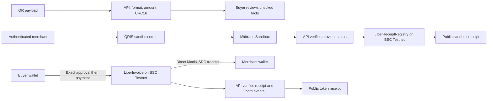

# Liber

**Familiar checkout, verifiable payment receipts on BNB Chain.**

Liber is a working sandbox payment workspace for Indonesian merchant and buyer workflows. It uses **Midtrans Sandbox** for QRIS integration and **BNB Smart Chain Testnet (chain ID 97)** for token invoices and public receipt commitments.

## Product flows

### 1. Inspect a QR before paying
The QR checker parses the payload and validates its format, Indonesian IDR fields, positive amount, and CRC16 checksum. The built-in Rp25,000 sample exposes its merchant and amount; a corrupted sample is rejected. These checks establish payload integrity, not merchant identity. Inspection does not initiate a payment.

### 2. Share a familiar QRIS checkout
An authenticated merchant creates a rupiah invoice and shares its buyer checkout link. The backend checks payment status with Midtrans and binds the provider status, environment, order, and amount into a receipt statement. Its hash is recorded by LiberReceiptRegistry on BNB. A completed Rp10,000 sandbox order demonstrates the provider integration and public receipt recording.

**Midtrans confirms payment status; BNB timestamps the receipt commitment.** The registry does not independently verify fiat settlement or move rupiah.

### 3. Pay and verify a native BNB invoice
The merchant specifies the receiving wallet, exact token amount, and expiry. The buyer approves that exact amount, then separately signs the payment. LiberInvoice transfers MockUSDC directly from buyer to merchant and records the paid invoice. Unknown, expired, cancelled, already-paid, and merchant self-payment attempts are rejected.

The public receipt checks:
- A successful transaction receipt on the configured chain.
- A matching InvoicePaid event for the invoice.
- An exact MockUSDC Transfer to the intended recipient.

A completed **5 MockUSDC** payment is available for inspection. Test tokens have no monetary value; TEST BNB is required for gas.

## Why BNB Chain

BNB supplies the execution and public evidence layer: native invoice state, direct token payments, and immutable receipt-hash timestamps. These are deployed contracts and confirmed testnet transactions, not a planned chain integration.

## Architecture

The frontend uses Next.js and viem; the backend uses Hono and PostgreSQL. Solidity contracts are built with Foundry. Frontend and API run on Vercel, with Neon providing PostgreSQL.

## Implemented safeguards

- Signed wallet authentication, expiring challenges, and atomic nonce consumption.
- Merchant ownership checks and retry-safe order creation.
- Provider status verification and duplicate receipt handling.
- Exact token approval and transfer verification.
- Contract tests covering replay, expiry, cancellation, transfer rollback, and amount checks.

These are implementation safeguards, not an independent security audit.

## Deployed contracts — BSC Testnet

- **LiberInvoice:** [0x2ad1785460b3c60b0131b0649b37dacf3dc17b1c](https://testnet.bscscan.com/address/0x2ad1785460b3c60b0131b0649b37dacf3dc17b1c)
- **LiberReceiptRegistry:** [0xf1267a5ab17b61c5c110b95d4dbb6197ffbbb46d](https://testnet.bscscan.com/address/0xf1267a5ab17b61c5c110b95d4dbb6197ffbbb46d)
- **MockUSDC:** [0x2116D4a3f11Aa7059Ad0911ad5C89897CC0BcC97](https://testnet.bscscan.com/address/0x2116D4a3f11Aa7059Ad0911ad5C89897CC0BcC97)

## Evidence and judge walkthrough

1. [Open the demo workspace](https://liber-bnb-web.vercel.app/demo).
2. Try the valid QR and corrupted sample under **QR checks**.
3. Open the [completed Rp10,000 sandbox receipt](https://liber-bnb-web.vercel.app/pilot/receipt?id=5e28547c-4936-4fdf-970b-198fc623fcf4) and its [BNB recording](https://testnet.bscscan.com/tx/0x12b0809769aac39b4274d08f9c0b37f1308048b5f4811232276cb7a2a55dcc83).
4. Open the [completed 5 MockUSDC invoice](https://liber-bnb-web.vercel.app/receipt?id=0x9472aacf99e2369eaf65a51d2e7b0f515c6433ac32d0450da1b18e9465ded034) and its [token payment](https://testnet.bscscan.com/tx/0x572e268f3a2a835dacfdfcadd1874997720f3b905f35bed52cc3f1101e263241).
5. Watch the [90-second BNB demo](https://youtu.be/WyFs-pF5AYM).

## Scope and next milestone

The current release uses sandbox QRIS and testnet tokens throughout. It does not perform production QRIS settlement, convert crypto into rupiah, or prove merchant identity through a checksum. Live AI is not part of this submission; QR inspection works with deterministic checks.

The next milestone is a merchant pilot after production provider onboarding and operational testing of payment expiry, refunds, reconciliation, and bank disbursement.

[Live website](https://liber-bnb-web.vercel.app/) · [Public GitHub repository](https://github.com/agadape/Liber_BnB_hackathon_2026) · [Demo video](https://youtu.be/WyFs-pF5AYM)
