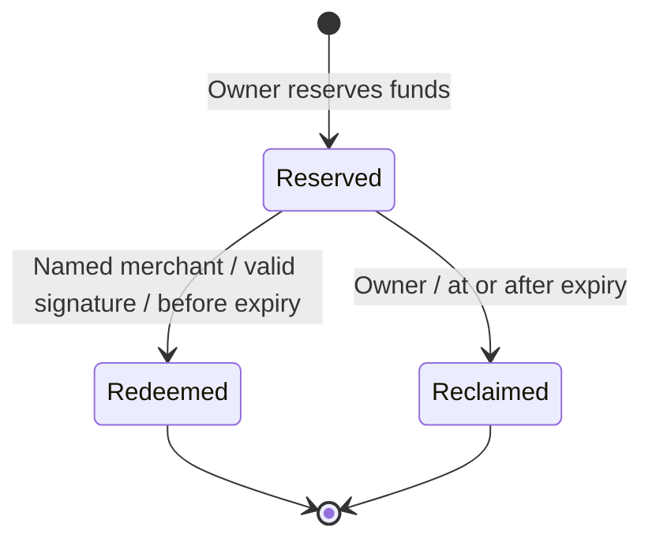

# liber:Ghost Protocol

**A prefunded payment permission that can leave your phone.**

The sandwich is ready. Your battery is not. Ghost asks what happens if a payment permission can be prepared earlier and carried on paper. The merchant stays online; the buyer need not return to their wallet at claim time.

## The problem and our first use case

Digital checkout often assumes a charged, connected buyer device. A dead battery or a deliberately screen-free outing breaks that assumption. A payment notification can report a transfer; Ghost explores a permission prepared before the moment of purchase.

Our proposed first use case is a bounded event with prearranged merchants and sandbox community tokens. It deliberately limits merchant choice. This is a pilot hypothesis, not a claim of existing customers or product-market fit. Preparation friction, scanning reliability and merchant willingness need measurement.

## What the working release does

1. **Buyer prepares online.** Choose one merchant wallet, the exact amount and an expiry. Sign an EIP-712 `GhostVoucher` authorization under the `LiberGhost` v1 domain. Approve tokens if needed and reserve the exact amount in the vault.
2. **Buyer hands over privately.** Paper/QR carries the signed authorization. It never contains the wallet private key. Reserve calldata omits the signature, so reserving does not publish an immediately redeemable packet.
3. **Merchant redeems online.** The named wallet claims before expiry and pays TEST BNB gas. The immutable vault verifies the authorization and lifecycle, releases the exact tokens and prevents a second claim. Redemption makes the authorization visible in public calldata.
4. **Owner recovers unused funds.** At or after expiry, the owner can send a reclaim transaction. It is not automatic and there is no early cancellation.

```mermaid
sequenceDiagram
  participant Buyer as Buyer (online preparation)
  participant Vault as BSC Ghost Vault
  participant Paper as Private paper / QR
  participant Merchant as Named merchant (online)
  Buyer->>Buyer: Choose recipient, amount and expiry; sign EIP-712
  Buyer->>Vault: Reserve exact tokens (signature excluded)
  Vault-->>Buyer: Reservation confirmed
  Buyer->>Paper: Export restricted authorization locally
  Paper->>Merchant: Private handover
  Merchant->>Vault: Redeem with named wallet before expiry
  Vault->>Merchant: Exact token transfer, one terminal claim
  Note over Buyer,Merchant: Buyer can be absent; merchant needs internet and gas
```



## Architecture and trust

- **Next.js frontend:** wallet connection, constrained preparation, local handover, merchant verification and wallet-owned recovery.
- **Immutable Solidity vault:** ERC-20 reservation, EIP-712 checks, merchant binding, expiry and single terminal state. No upgrade, pause, protocol fee or admin withdrawal.
- **API and database:** SIWE sessions for wallet-owned unsigned metadata; verified public receipts and bounded history recovery. The backend does not store active authorization signatures or wallet keys.
- **Receipt verification:** canonical blocks, expected vault events and exact ERC-20 transfers, with a 12-confirmation threshold. This is not an absolute finality guarantee.

The contract and signature remain the authorization source. Database records cannot create settlement. A signature alone is not a completed payment. A token transfer does not establish delivery of goods.

## BNB deployment

**Network:** BNB Smart Chain Testnet, chain **97**.

**Ghost vault:** [`0x0837ac35ec54F678ba08912dcfd6166a299FCA31`](https://testnet.bscscan.com/address/0x0837ac35ec54F678ba08912dcfd6166a299FCA31).

**MockUSDC:** [`0x2116D4a3f11Aa7059Ad0911ad5C89897CC0BcC97`](https://testnet.bscscan.com/address/0x2116D4a3f11Aa7059Ad0911ad5C89897CC0BcC97), 18 decimals, no cash value.

The EVM provides inspectable ERC-20 reservations and authorization enforcement. [Sourcify reports an exact source match](https://repo.sourcify.dev/97/0x0837ac35ec54F678ba08912dcfd6166a299FCA31). A verified source badge on BscScan is not claimed. Fees and performance have not been benchmarked for commercial claims.

## Evidence judges can inspect without a wallet

### A completed payment

The [public 5 MockUSDC receipt](https://liber-bnb-web.vercel.app/ghost/receipt?id=0xdfad2e816fba512fdda912ced241d9464c3f1358c16427fcfd7ac3fac2067924) links the reserve and [redemption transaction](https://testnet.bscscan.com/tx/0xea11ffb59b93e621f6f08ef221f91303e3c74c4392967e655bd2e6b7ec414b00). It verifies the transfer to the named merchant.

### Recovery of unused funds

A separate [2 MockUSDC receipt](https://liber-bnb-web.vercel.app/ghost/receipt?id=0x5f04a6af2b67a0519ed123946b3b5834d5648974ea23edfd8c70fbf2c0a567fb) links the [owner reclaim](https://testnet.bscscan.com/tx/0x0f8b2ecf962ffc1ba6e14aa3a27b407d3fcb4871f39a01c4f7227780f44eceb2) after expiry.

### Enforcement and application checks

The [on-chain exercise report](https://github.com/agadape/Liber_BnB_hackathon_2026/blob/main/contracts/deployments/ghost-demo-e2e.json) records wrong-merchant, replay and early-reclaim rejection, with matching transfers. [Hosted browser evidence](https://github.com/agadape/Liber_BnB_hackathon_2026/blob/main/contracts/deployments/ghost-ui-e2e.json) records a different payment and a same-voucher rescan rejected without another transaction. The browser exercise closed a voucher tab; it did not prove a whole buyer device was disconnected.

The recorded main build passed **171 tests** (61 frontend, 84 backend, 26 contracts including fuzz/invariant coverage). [Hosted API checks](https://github.com/agadape/Liber_BnB_hackathon_2026/blob/main/contracts/deployments/ghost-production-check.json) passed 12 scenarios covering authentication, owner isolation, metadata idempotence, signature rejection, proof/history verification and cursor ownership. These are engineering checks, not an independent audit.

## Limitations and next steps

Ghost supports EOA wallets in this release. Smart/delegated wallets are unsupported. Preparation requires the buyer online; redemption requires the merchant online with gas. Merchant preselection limits flexibility. Active QR leakage can let the named merchant claim earlier than intended; Ghost does not verify physical handover or delivery. Lost paper does not unlock funds early.

Physical buyer-phone-off, printed-paper readability and actual mobile wallet exercises remain pending. Next steps are a bounded sandbox merchant pilot, measurements of preparation/scanning friction, and independent security review. Real-value Indonesian deployment also requires a defined operating model and qualified legal/regulatory review. No rupiah settlement, QRIS conversion, mainnet launch, regulatory approval, adoption or revenue is claimed.

## Links

- [Live Ghost workspace](https://liber-bnb-web.vercel.app/ghost)
- [Public repository](https://github.com/agadape/Liber_BnB_hackathon_2026)
- [Two-minute judge guide](https://github.com/agadape/Liber_BnB_hackathon_2026/blob/main/docs/GHOST-JUDGE-GUIDE.md)
- [Ghost pitch PDF](https://github.com/agadape/Liber_BnB_hackathon_2026/blob/main/submission/Liber-Ghost-Protocol-Pitch.pdf)
- [Final Ghost demo film](https://www.youtube.com/watch?v=F03WVgskONw)
- [Public Ghost pitch deck](https://drive.google.com/file/d/1qod4wenq-ytOWXU0MFrWE098sNBVcWc1/view)
- [Submitted hackathon project](https://indonesiaweb3hack.xyz/en/projects/proj_4def0a781540276a5d)
